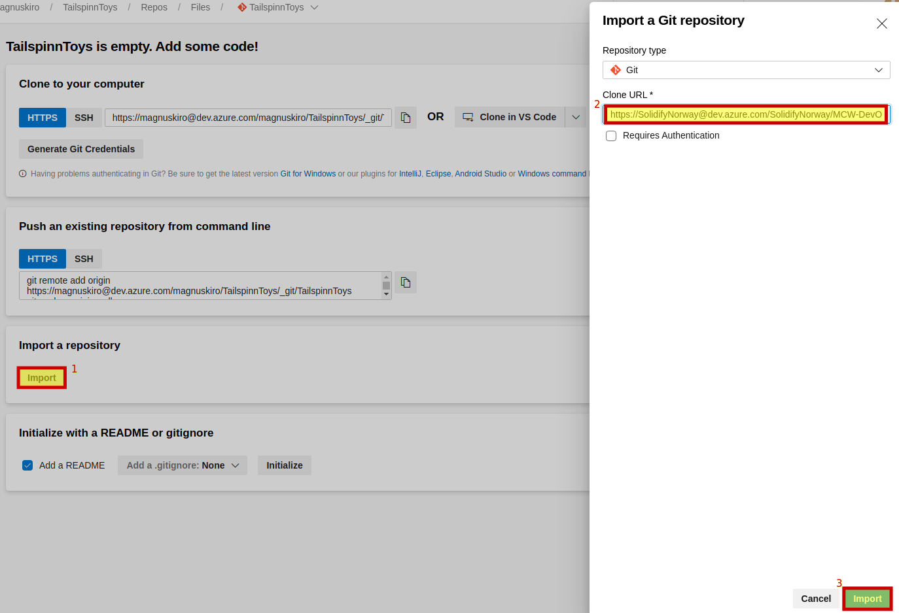
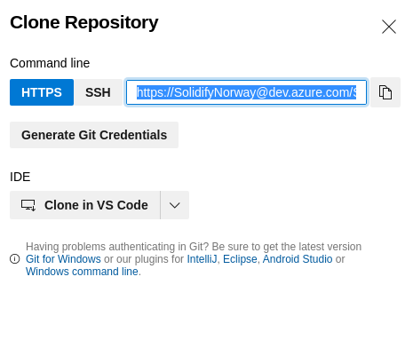
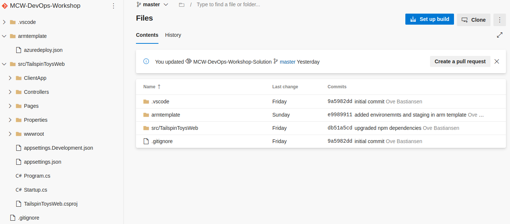
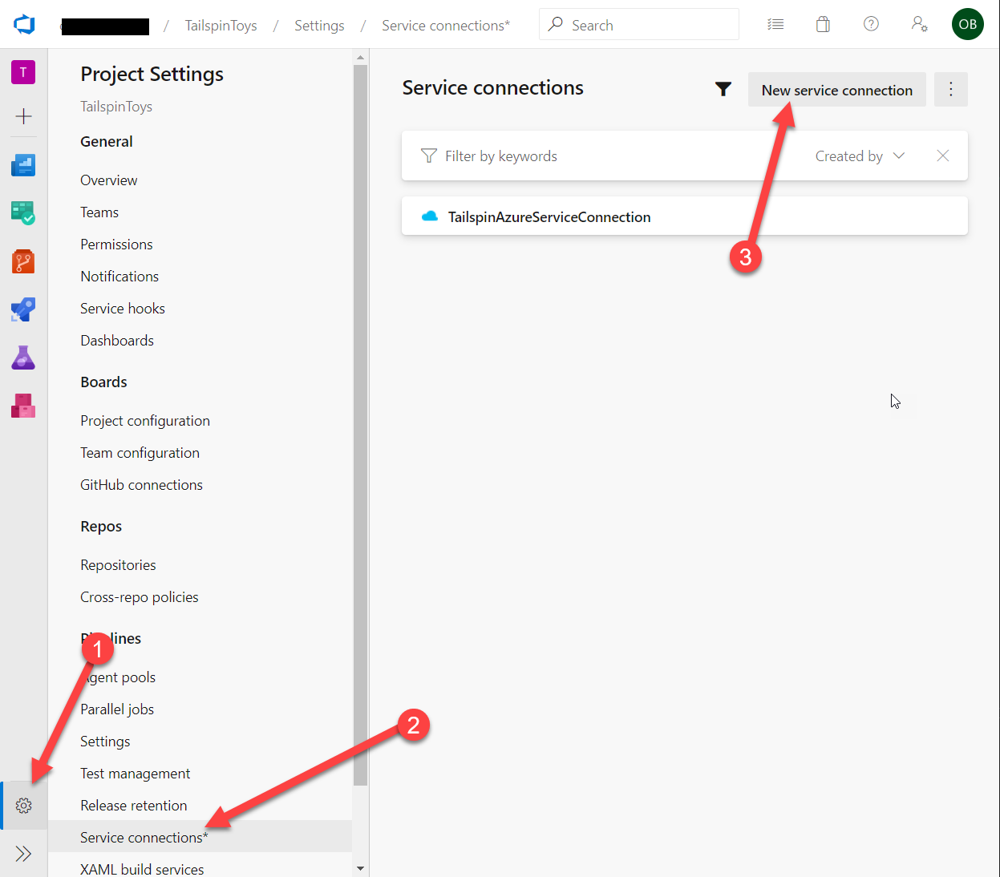
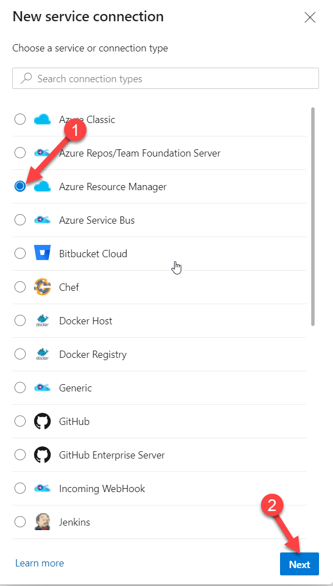
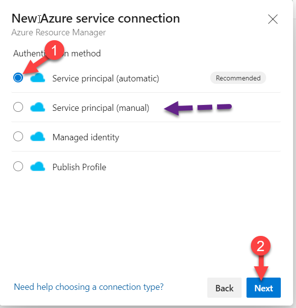
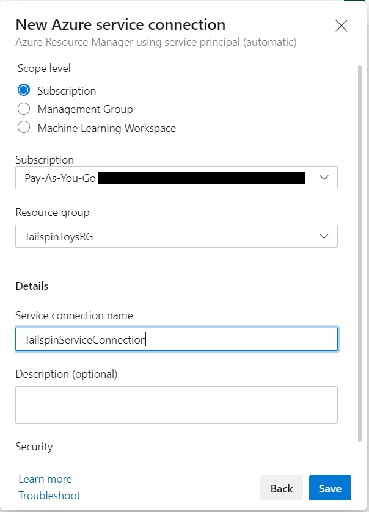
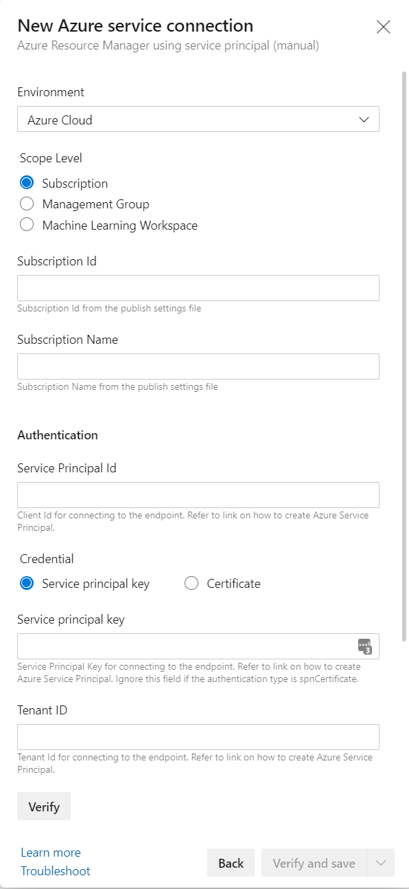
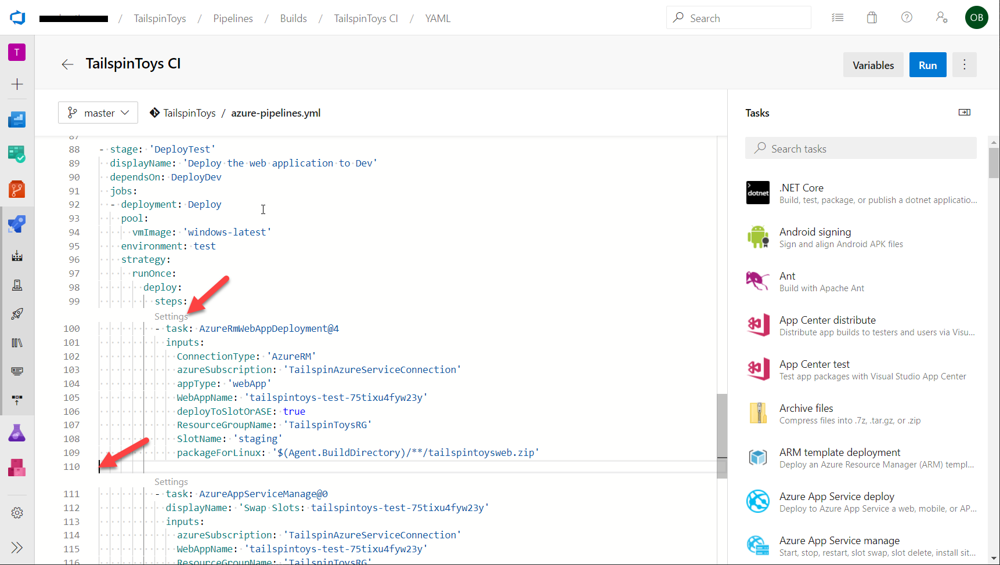
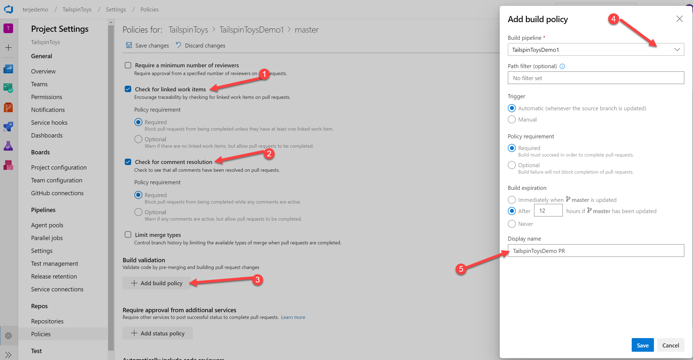

<div class="MCWHeader1">
Continuous delivery in Azure DevOps
</div>

<div class="MCWHeader2">
Hands-on lab step-by-step
</div>

<div class="MCWHeader3">
June 2020
</div>

Information in this document, including URL and other Internet Web site references, is subject to change without notice. Unless otherwise noted, the example companies, organizations, products, domain names, e-mail addresses, logos, people, places, and events depicted herein are fictitious, and no association with any real company, organization, product, domain name, e-mail address, logo, person, place or event is intended or should be inferred. Complying with all applicable copyright laws is the responsibility of the user. Without limiting the rights under copyright, no part of this document may be reproduced, stored in or introduced into a retrieval system, or transmitted in any form or by any means (electronic, mechanical, photocopying, recording, or otherwise), or for any purpose, without the express written permission of Microsoft Corporation.

Microsoft may have patents, patent applications, trademarks, copyrights, or other intellectual property rights covering subject matter in this document. Except as expressly provided in any written license agreement from Microsoft, the furnishing of this document does not give you any license to these patents, trademarks, copyrights, or other intellectual property.

The names of manufacturers, products, or URLs are provided for informational purposes only and Microsoft makes no representations and warranties, either expressed, implied, or statutory, regarding these manufacturers or the use of the products with any Microsoft technologies. The inclusion of a manufacturer or product does not imply endorsement of Microsoft of the manufacturer or product. Links may be provided to third party sites. Such sites are not under the control of Microsoft and Microsoft is not responsible for the contents of any linked site or any link contained in a linked site, or any changes or updates to such sites. Microsoft is not responsible for webcasting or any other form of transmission received from any linked site. Microsoft is providing these links to you only as a convenience, and the inclusion of any link does not imply endorsement of Microsoft of the site or the products contained therein.

© 2019 Microsoft Corporation. All rights reserved.

Microsoft and the trademarks listed at https://www.microsoft.com/en-us/legal/intellectualproperty/Trademarks/Usage/General.aspx are trademarks of the Microsoft group of companies. All other trademarks are property of their respective owners.

**Contents**
<!-- TOC -->

- [Continuous delivery in Azure DevOps hands-on lab step-by-step](#continuous-delivery-in-azure-devops-hands-on-lab-step-by-step)
  - [Abstract and learning objectives](#abstract-and-learning-objectives)
  - [Overview](#overview)
  - [Solution architecture](#solution-architecture)
  - [Requirements](#requirements)
  - [Exercise 1: Create Azure DevOps project and Git Repository](#exercise-1-create-azure-devops-project-and-git-repository)
    - [Task 1: Create Azure DevOps Account](#task-1-create-azure-devops-account)
    - [Task 2: Clone the Tailspin Toys repository to your local machine or cloud shell](#Task-2-Clone-the-Tailspin-Toys-repository-to-your-local-machine-or-cloud-shell)
  - [Exercise 2: Create Dockerfile](#Exercise-2-Create-Dockerfile)
    - [Task 1: Create a Dockerfile](#Task-1-Create-a-Dockerfile)
  - [Exercise 3: Create Azure DevOps build pipeline](#exercise-3-create-azure-devops-build-pipeline)
    - [Task 1: Create a build pipeline](#task-1-create-a-build-pipeline)
  - [Exercise 4: Add release steps to the build pipeline](#exercise-4-add-release-steps-to-the-build-pipeline)
    - [Task 1: Add a service connection to the azure subscription](#task-1-add-a-service-connection-to-the-azure-subscriptions)
    - [Task 2: Upgrade the build pipeline to a multistage pipeline and add deployment to dev](#task-2-upgrade-the-build-pipeline-to-a-multistage-pipeline-and-add-deployment-to-dev)
    - [Task 3: Add test and production environments to the pipeline](#task-3-add-test-and-production-environments-to-the-pipeline)
  - [Exercise 5: Trigger a build and release](#exercise-5-trigger-a-build-and-release)
    - [Task 1: Manually queue a new build and follow it through the release pipeline](#task-1-manually-queue-a-new-build-and-follow-it-through-the-release-pipeline)
  - [Exercise 6: Set up a Pull Request policy, create a task branch and submit a pull request](#exercise-6-set-up-a-pull-request-policy-create-a-task-branch-and-submit-a-pull-request)
    - [Task 1: Set up a Pull Request policy](#task-1-set-up-a-pull-request-policy)
    - [Task 2: Create a new branch](#task-2-create-a-new-branch)
    - [Task 3: Make a code change to the task branch](#task-3-make-a-code-change-to-the-task-branch)
    - [Task 4: Submit a pull request](#task-4-submit-a-pull-request)
    - [Task 5: Approve and complete a pull request](#task-5-approve-and-complete-a-pull-request)
  - [After the hands-on lab](#after-the-hands-on-lab)
    - [Task 1: Delete resources](#task-1-delete-resources)

<!-- /TOC -->

# Continuous delivery in Azure DevOps hands-on lab step-by-step

## Abstract and learning objectives 

In this hands-on lab, you will learn how to implement a solution with a combination of Azure Resource Manager templates and Azure DevOps to enable continuous delivery with several Azure PaaS services.

At the end of this workshop, you will be better able to implement solutions for continuous delivery with Azure DevOps in Azure, as well create an Azure Resource Manager (ARM) template to provision Azure resources, create an Azure DevOps project with a Git repository, and configure continuous delivery with Azure DevOps.

## Overview

Tailspin Toys has asked you to automate their development process in two specific ways. First, they want you to define an Azure Resource Manager template that can deploy their application into the Microsoft Azure cloud using Platform-as-a-Service technology for their web application and their PostgreSQL database. Second, they want you to implement a continuous delivery process that will connect their source code repository into the cloud, automatically run their code changes through unit tests, and then automatically create new software builds and deploy them onto environment-specific deployment slots so that each branch of code can be tested and accessed independently.

## Solution architecture


## Requirements

1.  Microsoft Azure subscription

  >**Note**: This entire lab can be completed using only the Azure Portal.

## Exercise 1: Create Azure DevOps project and Git Repository

Duration: 15 Minutes

In this exercise, you will create and configure an Azure DevOps account, an Agile project, and clone the base repo for this workshop.

### Task 1: Create Azure DevOps Account

1. Browse to the Azure DevOps site at <https://dev.azure.com>.

2. If you do not already have an account, select the **Start free** button.
    
    

3. Authenticate with a Microsoft account.

4. Choose **Continue** to accept the Terms of Service, Privacy Statement, and Code of Conduct.

5. Choose a name for new your project. For the purposes of this scenario, we will use *TailspinToys*. Choose **Private** in the Visibility section so that our project is only visible to those who we specifically grant access. Then, select **+ Create project**.
    
    

6. Once the Project is created, choose the **Repos** menu option in the left-hand navigation.

    

7. On the *Repos* page for the **TailspinToys** repository locate the "Import a repository" section and click the **Import** button. Then insert the url to the base repo in the pane that show up. Then click import. Your repo should now be initiated.

    

### Task 2: Clone the Tailspin Toys repository to your local machine or cloud shell

In this Task, you will the Git repository to your working directory. And push changes to Azure DevOps through the command line tools.

1.  Open a **Git command prompt** or the **Azure Cloud Shell**. 

    >**Note**: If you are using the Azure Cloud Shell you will be prompted for credentials when using Git. The best way to authenticate is to use a [personal access token](https://docs.microsoft.com/en-us/azure/devops/organizations/accounts/use-personal-access-tokens-to-authenticate), PAT, with a scope Code, Full permissions. Then use that PAT as password (leave user name empty) when prompted.

2. Clone the repo by pasting from your repo "git clone https://SolidifyNorway@dev.azure.com/SolidifyNorway/MCW-DevOps-Workshop/_git/MCW-DevOps-Workshop"



3. In case the *Password for 'https://\<your-org>@dev.azure.com':* prompt appears, follow the next steps to generate a PAT (Personal Access Token) for your Azure DevOps organization. Otherwise, skip to step 11.
    
    > **Note**: These steps are also useful when using a multi-factored protected user account with Azure DevOps.
    
    > **Note**: **DO NOT CLOSE AZURE CLOUD SHELL**. Use a different tab for the steps for creating a new PAT token.

4. In *Azure DevOps*, choose on the second to last icon on the top menu in the left-hand side of the screen, representing a user and a small gear icon.

5. From the context menu, choose **Personal access tokens**.

    

6. If the *Create a new personal access token* dialog has appeared, skip to the next step. Otherwise, select the **+ New Token** button.

    

7. In the *Create a new personal access token* dialog, type in a descriptive name for the new token, and from the *Code* section, choose **Full** and **Status**.

    

8. In the *Create a new personal access token* dialog, select the **Create** button.

9. From the success confirmation dialog, select the **Copy to clipboard** button to copy the newly created PAT token to clipboard.

    

10. In *Azure Cloud Shell*, paste the PAT token and press **Enter**.

11. Open Code to this folder by typing: 
   
   ```bash
   code .
   ``` 

   Then press **Enter**. 
   
   >**Note**: Be sure to include the period after the code command as this instructs Code to open the current directory context.

12. Make a change to the Readme file. Create 'README.md' file. Then add some text to the file. 

13. Type in the following commands to commit the changes made locally to the new repository:
    
    ```bash
    git add *
    git commit -m "adding REAMDE.md"
    ```

14. Push the changes up to the Azure DevOps repository with the following command:

    ```
    git push
    ```

15. Leave that command prompt window open and switch back to the web browser window for Azure DevOps from the previous Task. Navigate to the Repos > Files page which shows the files in the repository. You may need to refresh the page to see the updated files. Your source code is now appearing in Azure DevOps.

    

## Exercise 2: Create Dockerfile

Duration: 10 Minutes

In this excersice we implement a container definition. We do this with a 'Dockerfile' and by defining all our steps inside it.

Containers have multiple purposes. Among them are concistency, simplicity, and portability. Docker containers are the most videly spread container technology today. It is what we use here.

Containers are a way to make sure that your build and runtime is the same wherever you run it - Portability. 

To simplify the matter containers describe a set of steps that define the build and runtime environment - Simplicity. 

When your container is defined, you know it will run with the same result wherever you run it - Concistency.

### Task 1: Create a Dockerfile

1. Create a file called Dockerfile 

Right click in your editor -> choose 'New File'. 
Or write `touch Dockerfile` in a terminal.

2. Install node

Add RUN steps for installing nodejs in the container. We need this to build the frontend of the TailspinToys app.

In your Dockerfile add:
```
RUN apt-get update -yq 
RUN apt-get install curl gnupg -yq 
RUN curl -sL https://deb.nodesource.com/setup_14.x | bash -
RUN apt-get install -y nodejs
```

3. Add source code and build the app

Load the container with source code and build the code.

First include the code by adding these lines in your Dockerfile: 
```
WORKDIR /src
COPY ["src/TailspinToysWeb/TailspinToysWeb.csproj", "src/TailspinToysWeb/"]
```

Then we will build the code in the container by adding:  
```
RUN dotnet restore "src/TailspinToysWeb/TailspinToysWeb.csproj"
COPY . .
WORKDIR "/src/src/TailspinToysWeb"
RUN dotnet build "TailspinToysWeb.csproj" -c Release -o /app/build

# publish the app
FROM build AS publish
RUN dotnet publish "TailspinToysWeb.csproj" -c Release -o /app/publish
```

We use dotnet publish to packet the sourcode in a proper way. 

4. Running the app in the container

Now the container has the code and all dependencies it needs.

We have to tell it to run our application:
```
FROM base AS final
ENV ASPNETCORE_URLS http://+:5000
WORKDIR /app
EXPOSE 5000
# EXPOSE 5001
COPY --from=publish /app/publish .
ENTRYPOINT ["dotnet", "TailspinToysWeb.dll"]
```

5. See if it works?
We have to have a pipeline to test the container i azure devops. Commit and push your new dockerfile to your azure devops repo. Then continue to Excercise 3 below.

If you have docker installed on your local machine you can now build and run the container. While running the container you can visit localhost:5000 to see that the app is running.


## Exercise 3: Create Azure DevOps build pipeline

Duration: 15 Minutes

Implementing CI and CD pipelines helps to ensure consistent and quality code that's readily available to users. Azure Pipelines is a quick, easy, and safe way to automate building your projects and making them available to users.

In this exercise, you will create a build definition using Azure Pipelines, that will automatically build the web application with every commit of source code. This will lay the groundwork for us to then create a release pipeline for publishing the code to our Azure environments.
  
### Task 1: Create a build pipeline

Pipelines are made of one or more stages describing a CI/CD process. Stages are the major divisions in a pipeline: "build this app", "run these tests", and "deploy to pre-production" are good examples of stages.

Stages consist of one or more jobs, which are units of work assignable to a particular machine. Both stages and jobs may be arranged into dependency graphs: "run this stages before that one" or "this job depends on the output of that job".

Jobs consist of a linear series of steps. Steps can be tasks, scripts, or references to external templates.

This hierarchy is reflected in the structure of a YAML file.

1. In your Azure DevOps project, select the **Pipelines** menu option from the left-hand navigation.

    

2.  Select the **New pipeline** button to create a new build pipeline.

    

3. This starts a wizard where you'll first need to select where your current code is located. In a previous step, you pushed code up to Azure Repos. Select the **Azure Repos Git** option.

    

4. Next, you'll need to select the specific repository where your code was pushed. In a previous step, you pushed it to the **TailspinToys** repository. Select the **TailspinToys** git repository.

    

5. Then, you'll need to select the type of pipeline to configure. Although this pipeline contains a mix of technologies, select **ASP.NET Core** from the list of options.

    

6. As a final step in the creation of a build pipeline, you are presented with a configured pipeline in the form of an azure-pipelines.yml file. 
   
7. This starter YAML file contains a few lines of instructions (shown below) for the pipeline. Let's begin by updating the YAML with more specific instructions to build our application. 

    

The *pool* section specifies which pool to use for a job of the pipeline. It also holds information about the job's strategy for running.

8. Select and replace the *pool* section with the following code:

    ```yml
    pool:
      vmImage: 'windows-latest'
      demands:
      - msbuild
      - visualstudio
      - vstest
    ```

    Steps are a linear sequence of operations that make up a job. Each step runs in its own process on an agent and has access to the pipeline workspace on disk. This means environment variables are not preserved between steps but, file system changes are.

9. Select and replace the *steps* section with the following code:
    
    ```yml
    steps:
    - task: NuGetToolInstaller@0
      displayName: 'Use NuGet 4.4.1'
      inputs:
        versionSpec: 4.4.1
        
    - task: NodeTool@0
      inputs:
        versionSpec: '10.x'         
    ```

    Tasks are the building blocks of a pipeline. They describe the actions that are performed in sequence during an execution of the pipeline.

10. Add additional tasks to your azure-pipelines.yml file by selecting and copying the following code. This should be pasted right after the NuGetToolInstaller@0 task which you pasted previously:
    
    >**Note**: The YAML below creates individual tasks for performing all the necessary steps to build and test our application along with publishing the artifacts inside Azure DevOps so they can be retrieved during the upcoming release pipeline process.

    ```yaml
    - task: NuGetToolInstaller@0
      displayName: 'Use NuGet 4.4.1'
      inputs:
         versionSpec: 4.4.1

    # Node.js tool installer
    # Finds or downloads and caches the specified version spec of Node.js and adds it to the PATH
    - task: NodeTool@0
      inputs:
        versionSpec: '10.x' 

    - task: NuGetCommand@2
      displayName: 'NuGet restore'
      inputs:
        restoreSolution: 'tailspintoysweb.csproj'

    - task: VSBuild@1
      displayName: 'Build solution'
      inputs:
        solution: 'tailspintoysweb.csproj'
        msbuildArgs: '/p:DeployOnBuild=true /p:WebPublishMethod=Package /p:PackageAsSingleFile=true /p:SkipInvalidConfigurations=true /p:PackageLocation="$(build.artifactstagingdirectory)\\"'
        platform: 'any cpu'
        configuration: 'release'

    - task: PublishSymbols@2
      displayName: 'Publish symbols path'
      inputs:
        SearchPattern: '**\bin\**\*.pdb'
        PublishSymbols: false
      continueOnError: true

    - task: PublishBuildArtifacts@1
      displayName: 'Publish Artifact'
      inputs:
        PathtoPublish: '$(build.artifactstagingdirectory)'
        ArtifactName: 'TailspinToys-CI'
      condition: succeededOrFailed()
    ```

11. The final result will look like the following:

    ```yml
    trigger:
      - master

    pool:
      vmImage: 'windows-latest'
      demands:
      - msbuild
      - visualstudio
      - vstest

    variables:
      buildConfiguration: 'Release'

    steps:
    - task: NuGetToolInstaller@0
      displayName: 'Use NuGet 4.4.1'
      inputs:
        versionSpec: 4.4.1

    # Node.js tool installer
    # Finds or downloads and caches the specified version spec of Node.js and adds it to the PATH
    - task: NodeTool@0
      inputs:
        versionSpec: '10.x' 

    - task: NuGetCommand@2
      displayName: 'NuGet restore'
      inputs:
        restoreSolution: 'tailspintoysweb.csproj'

    - task: VSBuild@1
      displayName: 'Build solution'
      inputs:
        solution: 'tailspintoysweb.csproj'
        msbuildArgs: '/p:DeployOnBuild=true /p:WebPublishMethod=Package /p:PackageAsSingleFile=true /p:SkipInvalidConfigurations=true /p:PackageLocation="$(build.artifactstagingdirectory)\\"'
        platform: 'any cpu'
        configuration: 'release'

    - task: PublishSymbols@2
      displayName: 'Publish symbols path'
      inputs:
        SearchPattern: '**\bin\**\*.pdb'
        PublishSymbols: false
      continueOnError: true

    - task: PublishBuildArtifacts@1
      displayName: 'Publish Artifact'
      inputs:
        PathtoPublish: '$(build.artifactstagingdirectory)'
        ArtifactName: 'TailspinToys-CI'
      condition: succeededOrFailed()
    ```

12. Choose the **Save and run** button to save our new pipeline and also kick off the first build.

        

13. The new *azure-pipelines.yml* file will automatically be added to the root of your TailspinToys repository. This is done through a git commit that Azure DevOps facilitates. You are then asked to enter a commit description. By default, it will be populated for you. Once again, select the **Save and run** button at the bottom of the screen.

       

14. The build process will immediately begin and run through the steps defined in the azure-pipelines.yml file. Your Azure DevOps screen will refresh to show you the build process executing, in real-time. 

       

15. After the build process completes, you should see a green check mark next to each of the build pipeline steps.
  
     
    
    Congratulations! You have just created your first build pipeline. In the next exercise, we will create a release pipeline that deploys your successful builds.

## Exercise 4: Add release steps to the build pipeline

Duration: 30 Minutes

In this exercise, you will make changes to the build pipeline, so that it becomes a multistage pipeline. This means that the pipeline containes stages for performing automated deployments of build artifacts to Microsoft Azure. The multistage pipeline will first build the artifact and then deploy to three stages: dev, test, and production.

### Task 1: Add a service connection to the azure subscription
Before starting on the pipeline we have to first add a service connection we can use in the pipeline to target and authenticate to the correct Microsoft Azure Subscription.

1. Start by going to settings and add a new Azure Resource Manager and go through the wizard there.
    
   
   
   
   

2. In case a 'Service connection operation failed' dialog pops up, follow the next steps to manually create a service principal to use in this wizard. You would also like to follow these steps in case you want to granularly configure permissions for Azure DevOps to a single resource group rather than the entire subscription.

    **If you successfully authorized the Azure Subsription you may skip to the next task**

    > **Note**: The following workaround steps must be performed by a Global Administrator of the tenant associated to the Azure subscription, or at least an individual who has access to a user account with either of these Azure Active Directory roles: Application administrator, Application developer, Cloud application administrator.
        
3. In the Azure Portal, open the **Azure Active Directory** page.

4. In the *Azure Active Directory* page, choose **App registrations**.

5. In the *App registrations* page, choose **+ New registration**.

6. In the *Register an application*, type in a name for the application (e.g. **MCWAzureDevOps**).

7. For *Supported account types*, choose *Accounts in this organizational directory only*.

8. Select the **Register** button.

9. In the application page, note down the **Application (client) ID** - this will be used at a later step in this task and will be referred to as *Application ID*.

10. In the application page, note down the **Directory (tenant) ID** - this will be used at a later step in this task and will be referred to as *Directory ID*.

11. Choose **Certificates & secrets*.

12. In the *Certificates & secrets* page, select **+ New client secret**.

13. In the *Add a client secret* dialog, type in a descriptive description and choose **Never** for the expiration of the secret.

14. Select **Add**.

15. Copy the value of the secret now. This will not be displayed later and will be used at a later step in this task. The secret will be referred to as *Client secret*.

16. In the Azure Portal, open the **TailspinToysRg** resource group.

17. On the left-side of the page, choose **Access control (IAM)**.

18. On the top-menu, choose **+ Add**.

19. From the drop-down menu, choose **Add role assignment**.

20. In the **Add role assignment**, type in the following information:

    - For *Role*, choose **Contributor**
    - For *Select*, type in the name of the application you previously registered (e.g. *MCWAzureDevOps*)

    ")

29. Select the application returned from the query, and choose **Save**. 

30. Go back to Azure DevOps and start adding a new service connection, but this time select Service principal(manual)
    - For *Connection name*, type in a descriptive name which represents the connection your establishing between your Azure DevOps organization and Azure.
    - For *Environment*, choose **AzureCloud**.
    - For *Scope level*, choose **Subscription**.
    - For *Subscription ID*, type in your Azure subscription identifier where the resources were previously created. You may retrieve this information from running the following Azure CLI command in the Azure Cloud Shell editor previously used for provisioning and copying the value of the *id* property:

    ```
    az account show
    ```

    - For *Subscription name*, type in the exact name of the Azure subscription. Again, this information can be retrieved by using the same Azure CLI command previously described
    - For *Service pricipal client ID*, *Service principal key* and *Tenant ID*, type in the **Client ID**, **Client secret** and **Directory ID** values copied previously.

    

31. Choose the **Verify and save** button to validate the typed in information and create the new connection.

### Task 2: Upgrade the build pipeline to a multistage pipeline and add deployment to dev

1. First we need to add the correct keywords to our current build definition so that we can add more stages. Either open the azure-pipelines.yml file in Visual Studio code, or on the web and make sure the pipeline looks like this

    ```yml
    trigger:
      - master

    stages:
    - stage: 'Build'
      displayName: 'Build the web application'
      jobs: 
      - job: 'Build'
        displayName: 'Build job'
        pool:
          vmImage: 'windows-latest'
          demands:
          - msbuild
          - visualstudio
          - vstest
        variables:
          buildConfiguration: 'Release'
        steps:
        - task: NuGetToolInstaller@0
          displayName: 'Use NuGet 4.4.1'
          inputs:
            versionSpec: 4.4.1
        # rest of file is not shown, but all existing tasks needs to be here
    ```
2. Next we are going to add a stage for deployment to dev. The **dependsOn** setting indicates that this stage has to run after the Build stage is completed
    ```yml
    - stage: 'DeployDev'
      displayName: 'Deploy the web application to Dev'
      dependsOn: Build
    ```
3. We will use a job type called deployment that downloads all existing artifacts from this pipeline and we can select what environment we want to update. The environment a collection of resources that can be targeted during deployement, as well as being the place where we can add approval gates and other gates.

    ```yml
    - stage: 'DeployDev'
      displayName: 'Deploy the web application to Dev'
      dependsOn: Build
      jobs:
      - deployment: Deploy
        pool:
          vmImage: 'windows-latest'
        environment: dev
    ```

4. The next part is selecting what kind of strategy we want to use in our rollout phase, and if there are any predeploy or postdeploy steps we would like to do. Currently our setup is simple, so only a single deployment against a fixed set of resources
    ```yml
    strategy:
        runOnce:
        deploy:
            steps:
            - task: AzureRmWebAppDeployment@4
            inputs:
                ConnectionType: 'AzureRM'
                azureSubscription: 'TailspinAzureServiceConnection'
                appType: 'webApp'
                WebAppName: 'tailspintoys-dev-idfromresourcegroup'
                deployToSlotOrASE: true
                ResourceGroupName: 'TailspinToysRG'
                SlotName: 'staging'
                packageForLinux: '$(Agent.BuildDirectory)/**/tailspintoysweb.zip'

            - task: AzureAppServiceManage@0
            displayName: 'Swap Slots: tailspintoys-dev-idfromresourcegroup'
            inputs:
                azureSubscription: 'TailspinAzureServiceConnection'
                WebAppName: 'tailspintoys-dev-idfromresourcegroup'
                ResourceGroupName: 'TailspinToysRG'
                SourceSlot: staging
    ```

5. If you are using the web editor you can either add task where the cursor is, or edit a existing one by pressing settings
   
   

6. The final result will look like the following:

    ```yml
    - stage: 'DeployDev'
      displayName: 'Deploy the web application to Dev'
      dependsOn: Build
      jobs:
      - deployment: Deploy
        pool:
          vmImage: 'windows-latest'
        environment: dev
        strategy:
          runOnce:
            deploy:
              steps:
              - task: AzureRmWebAppDeployment@4
                inputs:
                  ConnectionType: 'AzureRM'
                  azureSubscription: 'TailspinAzureServiceConnection'
                  appType: 'webApp'
                  WebAppName: 'tailspintoys-dev-75tixu4fyw23y'
                  deployToSlotOrASE: true
                  ResourceGroupName: 'TailspinToysRG'
                  SlotName: 'staging'
                  packageForLinux: '$(Agent.BuildDirectory)/**/tailspintoysweb.zip'

              - task: AzureAppServiceManage@0
                displayName: 'Swap Slots: tailspintoys-dev-75tixu4fyw23y'
                inputs:
                  azureSubscription: 'TailspinAzureServiceConnection'
                  WebAppName: 'tailspintoys-dev-75tixu4fyw23y'
                  ResourceGroupName: 'TailspinToysRG'
                  SourceSlot: staging
    ```

7. Congratulations! You can now save the file, and push it to the master branch and wait for the trigger to kick in to deploy it to your dev web site

### Task 3: Add test and production environments to the pipeline

1. Now open the azure-pipelines.yml file once more and copy/paste the DeployDev stage twice, one for test and one for production. You need to update the **dependsOn** tag to match the correct previous stage and the name of the environment to the current stage. Also the name of the webapp will now contain test and production instead of dev.

2. All the release stages in the pipeline will now look like this
    
    ```yml    
    - stage: 'DeployDev'
      displayName: 'Deploy the web application to Dev'
      dependsOn: Build
      jobs:
      - deployment: Deploy
        pool:
          vmImage: 'windows-latest'
        environment: dev
        strategy:
          runOnce:
            deploy:
              steps:
              - task: AzureRmWebAppDeployment@4
                inputs:
                  ConnectionType: 'AzureRM'
                  azureSubscription: 'TailspinAzureServiceConnection'
                  appType: 'webApp'
                  WebAppName: 'tailspintoys-dev-idfromresourcegroup'
                  deployToSlotOrASE: true
                  ResourceGroupName: 'TailspinToysRG'
                  SlotName: 'staging'
                  packageForLinux: '$(Agent.BuildDirectory)/**/tailspintoysweb.zip'

              - task: AzureAppServiceManage@0
                displayName: 'Swap Slots: tailspintoys-dev-<id-from-resourcegroup>'
                inputs:
                  azureSubscription: 'TailspinAzureServiceConnection'
                  WebAppName: 'tailspintoys-dev-<id-from-resourcegroup>'
                  ResourceGroupName: 'TailspinToysRG'
                  SourceSlot: staging
    
    - stage: 'DeployTest'
      displayName: 'Deploy the web application to Test'
      dependsOn: DeployDev
      jobs:
      - deployment: Deploy
        pool:
          vmImage: 'windows-latest'
        environment: test
        strategy:
          runOnce:
            deploy:
              steps:
              - task: AzureRmWebAppDeployment@4
                inputs:
                  ConnectionType: 'AzureRM'
                  azureSubscription: 'TailspinAzureServiceConnection'
                  appType: 'webApp'
                  WebAppName: 'tailspintoys-test-idfromresourcegroup'
                  deployToSlotOrASE: true
                  ResourceGroupName: 'TailspinToysRG'
                  SlotName: 'staging'
                  packageForLinux: '$(Agent.BuildDirectory)/**/tailspintoysweb.zip'

              - task: AzureAppServiceManage@0
                displayName: 'Swap Slots: tailspintoys-test-idfromresourcegroup'
                inputs:
                  azureSubscription: 'TailspinAzureServiceConnection'
                  WebAppName: 'tailspintoys-test-idfromresourcegroup'
                  ResourceGroupName: 'TailspinToysRG'
                  SourceSlot: staging

    - stage: 'DeployProduction'
      displayName: 'Deploy the web application to Production'
      dependsOn: DeployTest
      jobs:
      - deployment: Deploy
        pool:
          vmImage: 'windows-latest'
        environment: production
        strategy:
          runOnce:
            deploy:
              steps:
              - task: AzureRmWebAppDeployment@4
                inputs:
                  ConnectionType: 'AzureRM'
                  azureSubscription: 'TailspinAzureServiceConnection'
                  appType: 'webApp'
                  WebAppName: 'tailspintoys-production-idfromresourcegroup'
                  deployToSlotOrASE: true
                  ResourceGroupName: 'TailspinToysRG'
                  SlotName: 'staging'
                  packageForLinux: '$(Agent.BuildDirectory)/**/tailspintoysweb.zip'

              - task: AzureAppServiceManage@0
                displayName: 'Swap Slots: tailspintoys-production-idfromresourcegroup'
                inputs:
                  azureSubscription: 'TailspinAzureServiceConnection'
                  WebAppName: 'tailspintoys-production-idfromresourcegroup'
                  ResourceGroupName: 'TailspinToysRG'
                  SourceSlot: staging

3. You can now save the file, and push it to the master branch and wait for the trigger to kick in to deploy it to your dev/test/production web sites

Congratulations! You have completed the creation of a release pipeline with three stages.

## Exercise 5: Trigger a build and release

Duration: 10 Minutes

In this exercise, you will trigger an automated build and release of the web application using the build and release pipelines you created in earlier exercises. The release pipeline will deploy to three stages: dev, test, and production.

Any commit of new or modified code to the master branch will automatically trigger a build. The steps below are useful when you want to manually trigger a build without a code change.

### Task 1: Manually queue a new build and follow it through the release pipeline

1. Select the *Pipelines* menu item from the left-hand navigation. 

2. In the *Pipelines* view, choose the *TailspinToys* pipeline recently created.

3. In the *TailspinToys* pipeline runs page, choose the *Run pipeline* button in the upper right section of the page.

    

4. This will present a modal window titled *Run pipeline*. Choose the **Run** button at the bottom of the modal window.

    

5. The screen will refresh and begin to show details about the build process.

6. When the build stage finished and because we configured continuous deployment, the deployment to the dev stage will automatically be triggered. It will continue through on to the test and production stages. A successful build through all four stages will look like the screen shot below.Once the build completes, it will resemble the snippet below.

    

## Exercise 6: Set up a Pull Request policy, create a task branch and submit a pull request

Duration: 30 Minutes

In this exercise, you will first set up a Pull request policy for your master branch, then you will create a short-lived task branch, make a small code change, commit and push the code, and submit a pull request. 
You'll then merge the pull request into the master branch which triggers an automated build and release of the application.

In the tasks below, you will make changes directly through the Azure DevOps web interface. These steps could also be performed locally through an IDE of your choosing or using the command line.

### Task 1: Set up a Pull Request policy

1.  Select the "Repos" menu item from the left-hand navigation. Then, choose "Branches".

Start creating by doing the steps 1-3 in the screenshot below


2.  Then enable the policy by checking 1 and 2 in screenshot below, and then click 3 to enable a build to run when the PR is created.  Inside that dialog, choose the correct build definition in 4, then set a nice name in 5.

The first check enables the build policy to require a work item to be included with the PR.  It may be added with one of the commits, or added directly to the PR.

(Notice: If you *do* enable this, which is the recommended setup, then you also must add a workitem in your process below with the code changes. Ignore this for the workshop if you dont want to do that.)

The second check is to ensure that if anyone comments on this PR during the peer review phase, then those comments have to be resolved.



3.  Save everything

### Task 2: Create a new branch

1. Select the **Repos** menu item from the left-hand navigation. Then, choose **Branches**.

    

2. Select the *New branch* button in the upper right corner of the page.

    

3. In the *Create a branch* dialog, enter a name for the new branch (e.g. **new-heading**). In the *Based on* field, be sure **master** is selected.

    

4. Select the **Create** button.

### Task 3: Make a code change to the task branch

1.  Choose the name of the newly created branch. This will present the *Files* window showing all the files in the repository.

    

2. Next, you'll make a change to a page in the web application inside the web browser.
   
    Select the **ClientApp** folder.

4. Then choose the **src** folder.

5. Next select the **app** folder.

6. Then, the **home** folder.

7. Locate and select the **home.component.html** file. It will display the contents of the file.

8. Select the **Edit** button on the top right of the screen to begin editing the page.

    

9. Replace the code ```<h1>Welcome to Tailspin Toys v1!</h1>``` on *line 1* with the following:

    ```
    <h1>Welcome to Tailspin Toys v2!</h1>
    ```
    
10. Now that you've completed the code change, select the **Commit** button on the top right side of the screen.

    

11. This will present the Commit dialog where you can enter a comment; one will automatically be filled in for you. Select the **Commit** button.

    

### Task 4: Submit a pull request

1. Near the top of the screen, locate the **Create a pull request** button.

    

2. This brings up the *New Pull Request* page. It shows we are submitting a request to merge code from our **new-heading** branch into the **master** branch. You have the option to change the *Title* and *Description* fields. 
    
    Locate the **Reviewers** field. 
    
    Type in **Tailspin** and select the search tooltip. 
    
    Select the **[TailspinToys]\TailspinToys Team** from the search results. This assigns The TailspinToys Team (which you are a member of) to review this pull request before it will be merged. The details of the code change are at the bottom of the page.

    

3. Select the **Create** button to submit the pull request.

### Task 5: Approve and complete a pull request

Typically, the next few steps would be performed by another team member. This would allow for the code to be peer reviewed. However, in this scenario, you will continue as if you are the only developer on the project.

1.  After submitting the pull request, you are presented with Pull Request review screen. Let's assume all the changes made were acceptable to the review team.
Confirm that the build is green, it is shown on the same page. 

Note that if the build is not green, you can not merge the Pull Request as in step 2-4 below. You are then blocked.

2. First, select the **Approve** button to approve of the code that was modified submitted as part of the pull request.

3. This will note that you approved the pull request. Then, choose the **Complete** button to finish and merge the code from the pull request into the master branch.

    

4.  After choosing the Complete button in the previous step, you will be presented with the Complete pull request popup. You can add additional comments for the merge activity. By selecting the *Delete new-heading after merging* option, our branch will be deleted after the merge has been completed. This keeps our repository clean of old and abandoned branches and eliminates the possibility of future confusion.

    

5.  Select the **Complete merge** button.

6.  You will then see a confirmation of the completed pull request.

    

7.  Congratulations! You just created a branch, made a code change, submitted a pull request, approved the pull request, and merged the code.

8.  Because we configured continuous integration and continuous deployment, an automated build will be triggered and deployment to dev stage will then begin immediately after a successful build. It will continue through on to the test and production stages.

    

## After the hands-on lab

Duration: 10 Minutes

### Task 1: Delete resources

1.  Now since the hands-on lab is complete, go ahead and delete the resource group you created for the Tailspin Toys deployments along with the Azure DevOps project that were created for this hands-on lab. You will no longer need those resources and it will be beneficial to clean up your Azure Subscription.

These steps should be followed only *after* completing the hands-on lab.
