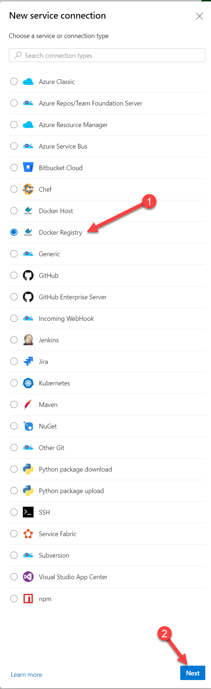
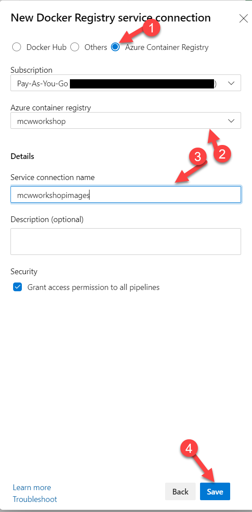
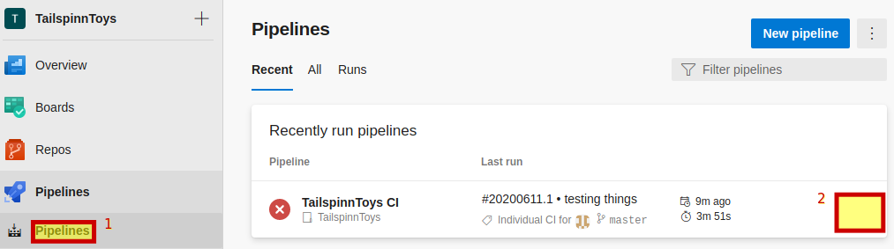
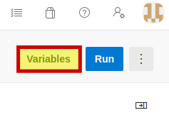
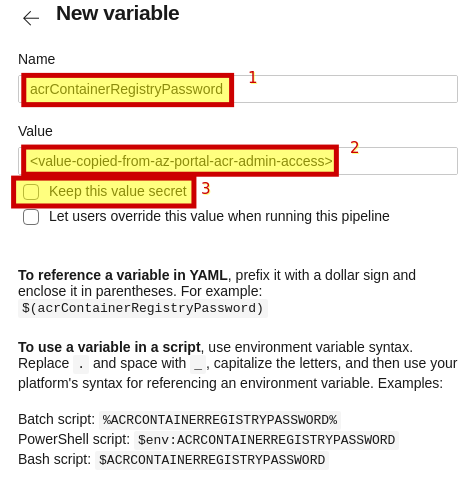

Continuous delivery of containers with Github

Hands-on lab step-by-step

Information in this document, including URL and other Internet Web site references, is subject to change without notice. Unless otherwise noted, the example companies, organizations, products, domain names, e-mail addresses, logos, people, places, and events depicted herein are fictitious, and no association with any real company, organization, product, domain name, e-mail address, logo, person, place or event is intended or should be inferred. Complying with all applicable copyright laws is the responsibility of the user. Without limiting the rights under copyright, no part of this document may be reproduced, stored in or introduced into a retrieval system, or transmitted in any form or by any means (electronic, mechanical, photocopying, recording, or otherwise), or for any purpose, without the express written permission of Microsoft Corporation.

Microsoft may have patents, patent applications, trademarks, copyrights, or other intellectual property rights covering subject matter in this document. Except as expressly provided in any written license agreement from Microsoft, the furnishing of this document does not give you any license to these patents, trademarks, copyrights, or other intellectual property.

The names of manufacturers, products, or URLs are provided for informational purposes only and Microsoft makes no representations and warranties, either expressed, implied, or statutory, regarding these manufacturers or the use of the products with any Microsoft technologies. The inclusion of a manufacturer or product does not imply endorsement of Microsoft of the manufacturer or product. Links may be provided to third party sites. Such sites are not under the control of Microsoft and Microsoft is not responsible for the contents of any linked site or any link contained in a linked site, or any changes or updates to such sites. Microsoft is not responsible for webcasting or any other form of transmission received from any linked site. Microsoft is providing these links to you only as a convenience, and the inclusion of any link does not imply endorsement of Microsoft of the site or the products contained therein.

© 2019 Microsoft Corporation. All rights reserved.

Microsoft and the trademarks listed at https://www.microsoft.com/en-us/legal/intellectualproperty/Trademarks/Usage/General.aspx are trademarks of the Microsoft group of companies. All other trademarks are property of their respective owners.

**Contents**
<!-- TOC -->

- [Continuous delivery in Azure DevOps hands-on lab step-by-step](#continuous-delivery-in-azure-devops-hands-on-lab-step-by-step)
  - [Abstract and learning objectives](#abstract-and-learning-objectives)
  - [Overview](#overview)
  - [Solution architecture](#solution-architecture)
  - [Requirements](#requirements)
  - [Exercise 1: Fork a repository in Github](#exercise-1-fork-a-repository-in-github)
    - [Task 1: Fork a Github repo](#task-1-fork-a-github-repo)
  - [Exercise 2: Create Dockerfile](#Exercise-2-Create-Dockerfile)
    - [Task 1: Create a Dockerfile](#Task-1-Create-a-Dockerfile)
  - [Exercise 3: Create a Azure Container registry](#exercise-3-create-a-azure-container-registry)
    - [Task 1: Create container registry](#task-1-create-container-registry)
  - [Exercise 4: Create Azure DevOps build pipeline](#exercise-3-create-azure-devops-build-pipeline)
    - [Task 1: Create a build pipeline](#task-1-create-a-build-pipeline)
  - [Exercise 5: Add release steps to the build pipeline](#exercise-5-add-release-steps-to-the-build-pipeline)
    - [Task 1: Add a service connection to the azure subscription](#task-1-add-a-service-connection-to-the-azure-subscription)
    - [Task 2: Add secrets to pipeline](#task-2-add-secrets-to-pipeline)
    - [Task 3: Upgrade the build pipeline to a multistage pipeline and add deployment to dev](#task-3-upgrade-the-build-pipeline-to-a-multistage-pipeline-and-add-deployment-to-dev)
    - [Task 4: Add test and production environments to the pipeline](#task-4-add-test-and-production-environments-to-the-pipeline)
  - [Exercise 6: Set up a Pull Request policy, create a task branch and submit a pull request](#exercise-6-set-up-a-pull-request-policy-create-a-task-branch-and-submit-a-pull-request)
    - [Task 1: Set up a Pull Request policy](#task-1-set-up-a-pull-request-policy)
    - [Task 2: Create a new branch](#task-2-create-a-new-branch)
    - [Task 3: Make a code change to the task branch](#task-3-make-a-code-change-to-the-task-branch)
    - [Task 4: Submit a pull request](#task-4-submit-a-pull-request)
    - [Task 5: Approve and complete a pull request](#task-5-approve-and-complete-a-pull-request)
  - [After the hands-on lab](#after-the-hands-on-lab)
    - [Task 1: Delete resources](#task-1-delete-resources)

<!-- /TOC -->

# Continuous delivery in Azure DevOps hands-on lab step-by-step

## Abstract and learning objectives 

In this hands-on lab, you will learn how to implement a solution with a combination of GitHub, GitHUb actions to enable continuous delivery with several Azure PaaS services.

At the end of this workshop, you will be better able to implement solutions for continuous delivery with GitHub, GitHub Actions and Azure.

## Overview

Tailspin Toys has asked you to automate their development process in two specific ways. First, they want you to define an Azure Resource Manager template that can deploy their application into the Microsoft Azure cloud using Platform-as-a-Service technology for their web application and their PostgreSQL database. Second, they want you to implement a continuous delivery process that will connect their source code repository into the cloud, automatically run their code changes through unit tests, and then automatically create new software builds and deploy them onto environment-specific deployment slots so that each branch of code can be tested and accessed independently.

## Solution architecture


## Requirements

1.  Github account
2.  Microsoft Azure subscription

## Exercise 1: Fork a repository in Github

Duration: 10 Minutes

In this exercise, you will fork a git repository in Github.
We assume you have a working github account.

You should learn to fork and some best practices about forking.

### Task 1: Fork a Github repo

In this Task, you will the Git repository to your working directory. And push changes to Azure DevOps through the command line tools.

1. Login to your Github account -> https://github.com/login

2. Navigate to the repo you want to fork -> https://github.com/solidify/MCW-DevOps-Workshop

3. Initiate a fork, clock the fork icon towards the top right corner.


4. Choose your account as the target for the fork:
Note that you can only fork a repository once into your account.


5. Forking best practices.
It's common to leave the main/master branch as a true copy of the forked repo. And use another branch for your local changes. 

6. Clone, commit, and Push to your fork

Clone the repository on your local machine `git clone https://github.com/solidify/MCW-DevOps-Workshop.git` (optionally choose the ssh link)

Create a file called `README.md`

Add it to the repo: `git add README.md`

Commit it `git commit -m "Added Readme.md"` 

Then push it `git push`


## Exercise 2: Create Dockerfile

Duration: 10 Minutes

In this excersice we implement a container definition. We do this with a 'Dockerfile' and by defining all our steps inside it.

Containers have multiple purposes. Among them are concistency, simplicity, and portability. Docker containers are the most videly spread container technology today. It is what we use here.

Containers are a way to make sure that your build and runtime is the same wherever you run it - Portability. 

To simplify the matter containers describe a set of steps that define the build and runtime environment - Simplicity. 

When your container is defined, you know it will run with the same result wherever you run it - Concistency.

### Task 1: Create a Dockerfile

1. Create a file called Dockerfile 

Right click in your editor -> choose 'New File'. 
Or write `touch Dockerfile` in a terminal.

2. Install node

Add RUN steps for installing nodejs in the container. We need this to build the frontend of the TailspinToys app.

In your Dockerfile add:
```
RUN apt-get update -yq 
RUN apt-get install curl gnupg -yq 
RUN curl -sL https://deb.nodesource.com/setup_14.x | bash -
RUN apt-get install -y nodejs
```

3. Add source code and build the app

Load the container with source code and build the code.

First include the code by adding these lines in your Dockerfile: 
```
WORKDIR /src
COPY ["src/TailspinToysWeb/TailspinToysWeb.csproj", "src/TailspinToysWeb/"]
```

Then we will build the code in the container by adding:  
```
RUN dotnet restore "src/TailspinToysWeb/TailspinToysWeb.csproj"
COPY . .
WORKDIR "/src/src/TailspinToysWeb"
RUN dotnet build "TailspinToysWeb.csproj" -c Release -o /app/build

# publish the app
FROM build AS publish
RUN dotnet publish "TailspinToysWeb.csproj" -c Release -o /app/publish
```

We use dotnet publish to packet the sourcode in a proper way. 

4. Running the app in the container

Now the container has the code and all dependencies it needs.

We have to tell it to run our application:
```
FROM base AS final
ENV ASPNETCORE_URLS http://+:5000
WORKDIR /app
EXPOSE 5000
# EXPOSE 5001
COPY --from=publish /app/publish .
ENTRYPOINT ["dotnet", "TailspinToysWeb.dll"]
```

5. See if it works?
We have to have a pipeline to test the container i azure devops. Commit and push your new dockerfile to your azure devops repo. Then continue to Excercise 3 below.

If you have docker installed on your local machine you can now build and run the container. While running the container you can visit localhost:5000 to see that the app is running.

6. The final result of the Dockerfile

```
FROM mcr.microsoft.com/dotnet/core/aspnet:3.1 AS base
WORKDIR /app

FROM mcr.microsoft.com/dotnet/core/sdk:3.1 AS build

# Prevent 'Warning: apt-key output should not be parsed (stdout is not a terminal)'
ENV APT_KEY_DONT_WARN_ON_DANGEROUS_USAGE=1

# install NodeJS 13.x
# see https://github.com/nodesource/distributions/blob/master/README.md#deb
RUN apt-get update -yq 
RUN apt-get install curl gnupg -yq 
RUN curl -sL https://deb.nodesource.com/setup_14.x | bash -
RUN apt-get install -y nodejs

WORKDIR /src
COPY ["src/TailspinToysWeb/TailspinToysWeb.csproj", "src/TailspinToysWeb/"]
RUN dotnet restore "src/TailspinToysWeb/TailspinToysWeb.csproj"
COPY . .
WORKDIR "/src/src/TailspinToysWeb"
RUN dotnet build "TailspinToysWeb.csproj" -c Release -o /app/build

FROM build AS publish
RUN dotnet publish "TailspinToysWeb.csproj" -c Release -o /app/publish

FROM base AS final
ENV ASPNETCORE_URLS http://+:5000
WORKDIR /app
EXPOSE 5000
# EXPOSE 5001
COPY --from=publish /app/publish .
ENTRYPOINT ["dotnet", "TailspinToysWeb.dll"]
```


## Exercise 3: Create a Azure Container registry

Duration 10 min. 

We will need the Container registry later, so we use it as an example to get some secret to store.

### Task 1: Create container registry

1. Goto add container registry
Go to the azure portal: `portal.azure.com`. On your subscription navigate to 'container registry'. And create a new one. 

   

Click the '+ Add' button to create a new registry.

2. Create container registry

Select your workshop resource group and set the name of the registry. Take note of the name as you will need this later.

   

3. Enable admin access

When the ACR is created we need to enable 'Access Keys' to be able to use registry in our workshop.

Go to 'Access Keys' and click 'Enable' under admin user. Then we can use one of the passwords in our pipeline variables.


## Exercise 4: Create Azure DevOps build pipeline

Duration: 15 Minutes

Implementing CI and CD pipelines helps to ensure consistent and quality code that's readily available to users. Azure Pipelines is a quick, easy, and safe way to automate building your projects and making them available to users.

In this exercise, you will create a build definition using Azure Pipelines, that will automatically build the web application with every commit of source code. This will lay the groundwork for us to then create a release pipeline for publishing the code to our Azure environments.
  
### Task 1: Create a build pipeline

Pipelines are made of one or more stages describing a CI/CD process. Stages are the major divisions in a pipeline: "build this app", "run these tests", and "deploy to pre-production" are good examples of stages.

Stages consist of one or more jobs, which are units of work assignable to a particular machine. Both stages and jobs may be arranged into dependency graphs: "run this stages before that one" or "this job depends on the output of that job".

Jobs consist of a linear series of steps. Steps can be tasks, scripts, or references to external templates.

This hierarchy is reflected in the structure of a YAML file.

1. Since we are building a docker image, we need to create a Azure Container Registry in the Azure portal, and add a service connection to that registry inside of your Azure Devops team project.
    
    
    

2. In your Azure DevOps project, select the **Pipelines** menu option from the left-hand navigation.

    

3.  Select the **New pipeline** button to create a new build pipeline.

    

4. This starts a wizard where you'll first need to select where your current code is located. In a previous step, you pushed code up to Azure Repos. Select the **Azure Repos Git** option.

    

5. Next, you'll need to select the specific repository where your code was pushed. In a previous step, you pushed it to the **TailspinToys** repository. Select the **TailspinToys** git repository.

    

6. Then, you'll need to select the type of pipeline to configure. Although this pipeline contains a mix of technologies, select **ASP.NET Core** from the list of options.

    

7. As a final step in the creation of a build pipeline, you are presented with a configured pipeline in the form of an azure-pipelines.yml file. 
   
8. This starter YAML file contains a few lines of instructions (shown below) for the pipeline. Let's begin by updating the YAML with more specific instructions to build our application. 

    

The *pool* section specifies which pool to use for a job of the pipeline. It also holds information about the job's strategy for running.

9. Select and replace the *pool* section with the following code:

    ```yml
    pool:
      vmImage: 'ubuntu-latest'
    ```

    Steps are a linear sequence of operations that make up a job. Each step runs in its own process on an agent and has access to the pipeline workspace on disk. This means environment variables are not preserved between steps but, file system changes are.

9. There is also a notion of variables you can reuse in different places in the build pipeline. So add a section that contains these variables

    ```yml
    variables:
      dockerRegistry: <the name of a Azure Container Registry service connection>
      imageRepository: tailspintoys/web
    ```
  

10. Select and replace the *steps* section with the following code:
    
    ```yml
    steps:
    - task: Docker@2
      displayName: Login to ACR
      inputs:
        command: login
        containerRegistry: $(dockerRegistry)

    - task: Docker@2
      displayName: Build and Push
      inputs:
        command: buildAndPush
        repository: $(imageRepository)
        tags: |
            $(Build.BuildId)

    - publish: $(System.DefaultWorkingDirectory)/armtemplate
      artifact: armtemplate       
    ```

    Tasks are the building blocks of a pipeline. They describe the actions that are performed in sequence during an execution of the pipeline. The steps here are logging into the container registry, then builds and pushes that image to the registry. The final publish is to make the arm template available for the next stages we are going to create for deploying the full solution.

11. The final result will look like the following:

    ```yml
    trigger:
      - master

    pool:
      vmImage: 'ubuntu-latest'
      
    variables:
      dockerRegistry: mcwworkshopimages
      imageRepository: tailspintoys/web

    steps:
    - task: Docker@2
      displayName: Login to ACR
      inputs:
        command: login
        containerRegistry: $(dockerRegistry)

    - task: Docker@2
      displayName: Build and Push
      inputs:
        command: buildAndPush
        repository: $(imageRepository)
        tags: |
            $(Build.BuildId)

    - publish: $(System.DefaultWorkingDirectory)/armtemplate
      artifact: armtemplate
    ```

12. Choose the **Save and run** button to save our new pipeline and also kick off the first build.

        

13. The new *azure-pipelines.yml* file will automatically be added to the root of your TailspinToys repository. This is done through a git commit that Azure DevOps facilitates. You are then asked to enter a commit description. By default, it will be populated for you. Once again, select the **Save and run** button at the bottom of the screen.

       

14. The build process will immediately begin and run through the steps defined in the azure-pipelines.yml file. Your Azure DevOps screen will refresh to show you the build process executing, in real-time. 

       

15. After the build process completes, you should see a green check mark next to each of the build pipeline steps.
  
     
    
    Congratulations! You have just created your first build pipeline. In the next exercise, we will create a release pipeline that deploys your successful builds.


## Exercise 5: Add release steps to the build pipeline

Duration: 45 Minutes

In this exercise, you will make changes to the build pipeline, so that it becomes a multistage pipeline. This means that the pipeline containes stages for performing automated deployments of build artifacts to Microsoft Azure. The multistage pipeline will first build the artifact and then deploy to three stages: dev, test, and production.

### Task 1: Add a service connection to the azure subscription
Before starting on the pipeline we have to first add a service connection we can use in the pipeline to target and authenticate to the correct Microsoft Azure Subscription.

1. Start by going to settings and add a new Azure Resource Manager and go through the wizard there.
    
   
   
   
   

2. In case a 'Service connection operation failed' dialog pops up, follow the next steps to manually create a service principal to use in this wizard. You would also like to follow these steps in case you want to granularly configure permissions for Azure DevOps to a single resource group rather than the entire subscription.

    **If you successfully authorized the Azure Subsription you may skip to the next task**

    > **Note**: The following workaround steps must be performed by a Global Administrator of the tenant associated to the Azure subscription, or at least an individual who has access to a user account with either of these Azure Active Directory roles: Application administrator, Application developer, Cloud application administrator.
        
3. In the Azure Portal, open the **Azure Active Directory** page.

4. In the *Azure Active Directory* page, choose **App registrations**.

5. In the *App registrations* page, choose **+ New registration**.

6. In the *Register an application*, type in a name for the application (e.g. **MCWAzureDevOps**).

7. For *Supported account types*, choose *Accounts in this organizational directory only*.

8. Select the **Register** button.

9. In the application page, note down the **Application (client) ID** - this will be used at a later step in this task and will be referred to as *Application ID*.

10. In the application page, note down the **Directory (tenant) ID** - this will be used at a later step in this task and will be referred to as *Directory ID*.

11. Choose **Certificates & secrets*.

12. In the *Certificates & secrets* page, select **+ New client secret**.

13. In the *Add a client secret* dialog, type in a descriptive description and choose **Never** for the expiration of the secret.

14. Select **Add**.

15. Copy the value of the secret now. This will not be displayed later and will be used at a later step in this task. The secret will be referred to as *Client secret*.

16. In the Azure Portal, open the **TailspinToysRg** resource group.

17. On the left-side of the page, choose **Access control (IAM)**.

18. On the top-menu, choose **+ Add**.

19. From the drop-down menu, choose **Add role assignment**.

20. In the **Add role assignment**, type in the following information:

    - For *Role*, choose **Contributor**
    - For *Select*, type in the name of the application you previously registered (e.g. *MCWAzureDevOps*)

    ")

29. Select the application returned from the query, and choose **Save**. 

30. Go back to Azure DevOps and start adding a new service connection, but this time select Service principal(manual)
    - For *Connection name*, type in a descriptive name which represents the connection your establishing between your Azure DevOps organization and Azure.
    - For *Environment*, choose **AzureCloud**.
    - For *Scope level*, choose **Subscription**.
    - For *Subscription ID*, type in your Azure subscription identifier where the resources were previously created. You may retrieve this information from running the following Azure CLI command in the Azure Cloud Shell editor previously used for provisioning and copying the value of the *id* property:

    ```
    az account show
    ```

    - For *Subscription name*, type in the exact name of the Azure subscription. Again, this information can be retrieved by using the same Azure CLI command previously described
    - For *Service pricipal client ID*, *Service principal key* and *Tenant ID*, type in the **Client ID**, **Client secret** and **Directory ID** values copied previously.

    

31. Choose the **Verify and save** button to validate the typed in information and create the new connection.

### Task 2: Add secrets to pipeline
When building code it's important to control access to your systems. When adding usernames and passwords we need to secure these.

In azure devops we do this by adding variables to the pipelines and making the secret so that the passwords don't show.

It's important to note that in a production setting we would create separate secrets for each environment and lock down secrets editing. And even better use an azure vault to store our secrets.

1. Go to your pipeline and edit it.
step 2 in the image is where three dots will appear and you can choose 'edit'



2. Click 'Variables' in the top right. Then click the '+' plus to add a new variable.



3. Add new variable

Set the name of the variable: 'acrContainerRegistryPassword'. We will need this in our pipeline.

Add the acr password you copied rom the azure portal to the 'Value' field. 

Tick the "Keep this value secret" to remove visibility in pipeline runs. This is highly recommended.



4. Add a second variable that will hold our database password, also as a secret. Name it secretPasswordVariable and put in a strong password, you dont need to remember it for later.

### Task 3: Upgrade the build pipeline to a multistage pipeline and add deployment to dev

1. First we need to add the correct keywords to our current build definition so that we can add more stages. Either open the azure-pipelines.yml file in Visual Studio code, or on the web and make sure the pipeline looks like this

    ```yml
    trigger:
      - master

    stages:
    - stage: 'Build'
      displayName: 'Build the web application'
      jobs: 
      - job: 'Build'
        displayName: 'Build job'
        pool:
          vmImage: 'ubuntu-latest'

        steps:
        - task: Docker@2
          displayName: Login to ACR
          inputs:
            command: login
            containerRegistry: $(dockerRegistry)
        # rest of file is not shown, but all existing tasks needs to be here
    ```
2. Next we are going to add a stage for deployment to dev. The **dependsOn** setting indicates that this stage has to run after the Build stage is completed
    ```yml
    - stage: 'DeployDev'
      displayName: 'Deploy the web application to Dev'
      dependsOn: Build
    ```
3. We will use a job type called deployment that downloads all existing artifacts from this pipeline and we can select what environment we want to update. The environment a collection of resources that can be targeted during deployement, as well as being the place where we can add approval gates and other gates.

    ```yml
    - stage: 'DeployDev'
      displayName: 'Deploy the web application to Dev'
      dependsOn: Build
      jobs:
      - deployment: Deploy
        pool:
          vmImage: 'ubuntu-latest'
        environment: dev
    ```

4. The next part is selecting what kind of strategy we want to use in our rollout phase, and if there are any predeploy or postdeploy steps we would like to do. Currently our setup is simple, so only a single deployment that creates the infrastructure and deployes a fixed set of resources
    ```yml
    strategy:
      runOnce:
        deploy:
          steps:
          - task: AzureResourceGroupDeployment@2
            displayName: 'Deploy template'
            inputs:
              deploymentScope: 'Resource Group'
              ConnectedServiceName: $(azureSubscription)
              subscriptionName: '6549e907-7551-49a6-a486-bc5f11d74660'
              action: 'Create Or Update Resource Group'
              resourceGroupName: $(resourceGroupName)
              location: 'West Europe'
              templateLocation: 'Linked artifact'
              csmFile: '$(Pipeline.Workspace)/armtemplate/azuredeploy.json'
              overrideParameters: -environment dev -administratorLogin databaseAdminUser -administratorLoginPassword $(secretPasswordVariable)
              deploymentOutputs: ArmOutputs
    ```
This uses the arm template we pushed as artifacts in the buildpipeline to provision our dev website and the dev database. Important parts here is using the service connection created in the previouse step as the connected service name and using the secret password variable from the builddefinition itself.

5. If you are using the web editor you can either add task where the cursor is, or edit a existing one by pressing settings
   
   

6. Our ARM template contains an output variable of out new website and we now need to parse that output of the webappname so we can use that to target our deployment in azure
    ```yml
    - pwsh: |
        $armOutputObj = '$(ArmOutputs)' | ConvertFrom-Json
        $webAppName = $armOutputObj.webappname.value
        Write-Host "##vso[task.setvariable variable=webappname]$webAppName"
      displayName: "Parsing outputs from ARM deployment to pipeline variables"
    ```
7. Now we are using Azure CLI to actually deploy our containerimage into our Azure App Service. We are using Azure CLI to showcase here that we can do that from the pipeline, and the fact that the AzureAppService deployement task does not work with Azure Container registry, only with Docker Hub. We also deploy to a staging slog and then swap to production slot after the deployment is done and the website is ready to take traffic.
    ```yml
    - task: AzureCLI@2
      inputs:
        azureSubscription: $(azureSubscription)
        scriptType: 'pscore'
        scriptLocation: 'inlineScript'
        inlineScript: |
          az --version
          az account show
          az webapp config container set `
                    --resource-group $(resourceGroupName) `
                    --name $(webappname) `
                    --docker-custom-image-name $(imageName) `
                    --docker-registry-server-password $(acrContainerRegistryPassword) `
                    --docker-registry-server-url https://<registryName>.azurecr.io `
                    --docker-registry-server-user <registryName> `
                    --slot staging

    - task: AzureAppServiceManage@0
      displayName: 'Swap Slots: $(resourceGroupName)'
      inputs:
        azureSubscription: '$(azureSubscription)'
        WebAppName: $(webappname)
        ResourceGroupName: $(resourceGroupName)
        SourceSlot: staging
    ```

6. The final result will look like the following:

    ```yml
    - stage: 'DeployDev'
      displayName: 'Deploy the web application to Dev'
      dependsOn: Build
      jobs:
      - deployment: Deploy
        pool:
          vmImage: 'ubuntu-latest'
        environment: dev
        strategy:
          runOnce:
            deploy:
              steps:
              - task: AzureResourceGroupDeployment@2
                displayName: 'Deploy template'
                inputs:
                  deploymentScope: 'Resource Group'
                  ConnectedServiceName: $(azureSubscription)
                  subscriptionName: '6549e907-7551-49a6-a486-bc5f11d74660'
                  action: 'Create Or Update Resource Group'
                  resourceGroupName: $(resourceGroupName)
                  location: 'West Europe'
                  templateLocation: 'Linked artifact'
                  csmFile: '$(Pipeline.Workspace)/armtemplate/azuredeploy.json'
                  overrideParameters: -environment dev -administratorLogin JallaJalla -administratorLoginPassword $(dbPassword)
                  deploymentOutputs: ArmOutputs
              
              - pwsh: |
                  $armOutputObj = '$(ArmOutputs)' | ConvertFrom-Json
                  $webAppName = $armOutputObj.webappname.value
                  Write-Host "##vso[task.setvariable variable=webappname]$webAppName"
                displayName: "Parsing outputs from ARM deployment to pipeline variables"
              
              - task: AzureCLI@2
                inputs:
                  azureSubscription: $(azureSubscription)
                  scriptType: 'pscore'
                  scriptLocation: 'inlineScript'
                  inlineScript: |
                    az --version
                    az account show
                    az webapp config container set `
                              --resource-group $(resourceGroupName) `
                              --name $(webappname) `
                              --docker-custom-image-name $(imageName) `
                              --docker-registry-server-password $(acrContainerRegistryPassword) `
                              --docker-registry-server-url https://<registryName>.azurecr.io `
                              --docker-registry-server-user <registryName> `
                              --slot staging

              - task: AzureAppServiceManage@0
                displayName: 'Swap Slots: $(resourceGroupName)'
                inputs:
                  azureSubscription: '$(azureSubscription)'
                  WebAppName: $(webappname)
                  ResourceGroupName: $(resourceGroupName)
                  SourceSlot: staging
              
    ```

7. Congratulations! You can now save the file, and push it to the master branch and wait for the trigger to kick in to deploy it to your dev web site

### Task 4: Add test and production environments to the pipeline

1. Now open the azure-pipelines.yml file once more and copy/paste the DeployDev stage twice, one for test and one for production. You need to update the **dependsOn** tag to match the correct previous stage and the name of the environment to the current stage. Also the name of the webapp will now contain test and production instead of dev.

2. All the release stages in the pipeline will now look like this
    
    ```yml
    - stage: 'DeployDev'
      displayName: 'Deploy the web application to Dev'
      dependsOn: Build
      jobs:
      - deployment: Deploy
        pool:
          vmImage: 'ubuntu-latest'
        environment: dev
        strategy:
          runOnce:
            deploy:
              steps:
              - task: AzureResourceGroupDeployment@2
                displayName: 'Deploy template'
                inputs:
                  deploymentScope: 'Resource Group'
                  ConnectedServiceName: $(azureSubscription)
                  subscriptionName: '6549e907-7551-49a6-a486-bc5f11d74660'
                  action: 'Create Or Update Resource Group'
                  resourceGroupName: $(resourceGroupName)
                  location: 'West Europe'
                  templateLocation: 'Linked artifact'
                  csmFile: '$(Pipeline.Workspace)/armtemplate/azuredeploy.json'
                  overrideParameters: -environment dev -administratorLogin JallaJalla -administratorLoginPassword $(dbPassword)
                  deploymentOutputs: ArmOutputs
              
              - pwsh: |
                  $armOutputObj = '$(ArmOutputs)' | ConvertFrom-Json
                  $webAppName = $armOutputObj.webappname.value
                  Write-Host "##vso[task.setvariable variable=webappname]$webAppName"
                displayName: "Parsing outputs from ARM deployment to pipeline variables"
              
              - task: AzureCLI@2
                inputs:
                  azureSubscription: $(azureSubscription)
                  scriptType: 'pscore'
                  scriptLocation: 'inlineScript'
                  inlineScript: |
                    az --version
                    az account show
                    az webapp config container set `
                              --resource-group $(resourceGroupName) `
                              --name $(webappname) `
                              --docker-custom-image-name $(imageName) `
                              --docker-registry-server-password $(acrContainerRegistryPassword) `
                              --docker-registry-server-url https://<registryName>.azurecr.io `
                              --docker-registry-server-user <registryName> `
                              --slot staging

              - task: AzureAppServiceManage@0
                displayName: 'Swap Slots: $(resourceGroupName)'
                inputs:
                  azureSubscription: '$(azureSubscription)'
                  WebAppName: $(webappname)
                  ResourceGroupName: $(resourceGroupName)
                  SourceSlot: staging
    
    - stage: 'DeployTest'
      displayName: 'Deploy the web application to Test'
      dependsOn: DeployDev
      jobs:
      - deployment: Deploy
        pool:
          vmImage: 'ubuntu-latest'
        environment: test
        strategy:
          runOnce:
            deploy:
              steps:
              - task: AzureResourceGroupDeployment@2
                displayName: 'Deploy template'
                inputs:
                  deploymentScope: 'Resource Group'
                  ConnectedServiceName: $(azureSubscription)
                  subscriptionName: '6549e907-7551-49a6-a486-bc5f11d74660'
                  action: 'Create Or Update Resource Group'
                  resourceGroupName: $(resourceGroupName)
                  location: 'West Europe'
                  templateLocation: 'Linked artifact'
                  csmFile: '$(Pipeline.Workspace)/armtemplate/azuredeploy.json'
                  overrideParameters: -environment test -administratorLogin JallaJalla -administratorLoginPassword $(dbPassword)
                  deploymentOutputs: ArmOutputs
              
              - pwsh: |
                  $armOutputObj = '$(ArmOutputs)' | ConvertFrom-Json
                  $webAppName = $armOutputObj.webappname.value
                  Write-Host "##vso[task.setvariable variable=webappname]$webAppName"
                displayName: "Parsing outputs from ARM deployment to pipeline variables"
              
              - task: AzureCLI@2
                inputs:
                  azureSubscription: $(azureSubscription)
                  scriptType: 'pscore'
                  scriptLocation: 'inlineScript'
                  inlineScript: |
                    az --version
                    az account show
                    az webapp config container set `
                              --resource-group $(resourceGroupName) `
                              --name $(webappname) `
                              --docker-custom-image-name $(imageName) `
                              --docker-registry-server-password $(acrContainerRegistryPassword) `
                              --docker-registry-server-url https://<registryName>.azurecr.io `
                              --docker-registry-server-user <registryName> `
                              --slot staging

              - task: AzureAppServiceManage@0
                displayName: 'Swap Slots: $(resourceGroupName)'
                inputs:
                  azureSubscription: '$(azureSubscription)'
                  WebAppName: $(webappname)
                  ResourceGroupName: $(resourceGroupName)
                  SourceSlot: staging

    - stage: 'DeployProduction'
      displayName: 'Deploy the web application to Production'
      dependsOn: DeployTest
      jobs:
      - deployment: Deploy
        pool:
          vmImage: 'ubuntu-latest'
        environment: production
        strategy:
          runOnce:
            deploy:
              steps:
              - task: AzureResourceGroupDeployment@2
                displayName: 'Deploy template'
                inputs:
                  deploymentScope: 'Resource Group'
                  ConnectedServiceName: $(azureSubscription)
                  subscriptionName: '6549e907-7551-49a6-a486-bc5f11d74660'
                  action: 'Create Or Update Resource Group'
                  resourceGroupName: $(resourceGroupName)
                  location: 'West Europe'
                  templateLocation: 'Linked artifact'
                  csmFile: '$(Pipeline.Workspace)/armtemplate/azuredeploy.json'
                  overrideParameters: -environment production -administratorLogin JallaJalla -administratorLoginPassword $(dbPassword)
                  deploymentOutputs: ArmOutputs
              
              - pwsh: |
                  $armOutputObj = '$(ArmOutputs)' | ConvertFrom-Json
                  $webAppName = $armOutputObj.webappname.value
                  Write-Host "##vso[task.setvariable variable=webappname]$webAppName"
                displayName: "Parsing outputs from ARM deployment to pipeline variables"
              
              - task: AzureCLI@2
                inputs:
                  azureSubscription: $(azureSubscription)
                  scriptType: 'pscore'
                  scriptLocation: 'inlineScript'
                  inlineScript: |
                    az --version
                    az account show
                    az webapp config container set `
                              --resource-group $(resourceGroupName) `
                              --name $(webappname) `
                              --docker-custom-image-name $(imageName) `
                              --docker-registry-server-password $(acrContainerRegistryPassword) `
                              --docker-registry-server-url https://<registryName>.azurecr.io `
                              --docker-registry-server-user <registryName> `
                              --slot staging

              - task: AzureAppServiceManage@0
                displayName: 'Swap Slots: $(resourceGroupName)'
                inputs:
                  azureSubscription: '$(azureSubscription)'
                  WebAppName: $(webappname)
                  ResourceGroupName: $(resourceGroupName)
                  SourceSlot: staging
    ```
3. You can now save the file, and push it to the master branch and wait for the trigger to kick in to deploy it to your dev/test/production web sites

Congratulations! You have completed the creation of a multistage pipeline with four stages.

## Exercise 6: Set up a Pull Request policy, create a task branch and submit a pull request

Duration: 30 Minutes

In this exercise, you will first set up a Pull request policy for your master branch, then you will create a short-lived task branch, make a small code change, commit and push the code, and submit a pull request. 
You'll then merge the pull request into the master branch which triggers an automated build and release of the application.

In the tasks below, you will make changes directly through the Azure DevOps web interface. These steps could also be performed locally through an IDE of your choosing or using the command line.

### Task 1: Commit new file with a Pull request

1. Select the branch you want to change or add content to.


2. Choose 'add file' to add a file to the repo.


3. Edit the file and choose new branch

Choose name and content for the file.


Then create a commit heading, and describe the change in the commit.
Make sure to select "new branch" when you create files in a repo with multiple contributors.


Now the file should be added to a new branch. 


4. Create a pull request

Navigate to 'Pull requests'.
The click "compare & pull request"


Then choose the correct repositofy and branch you want to push to.


Add apropriate description, reviewers, and labels to the pull request.


Then click create.

5. Merge the pull request
Now you can see the created pull request. 
If everything is good, then you can merge it.


### Task 2: 

Here you can add rules to your branches to better control the quality of the code that is merged to your branches.
The typical rules you add are to enforce reviewers on pull requests, and passed status checks so that automated testing and integrations are OK.

1. Navigate to settings


2. Add new rules

Set the text pattern that matches the branches you want rules for. 

Then enable the rules you want. Typically `Require pull request reviews before merging` and `Require status checks to pass before merging`


## After the hands-on lab

Duration: 10 Minutes

### Task 1: Delete resources

1.  Now since the hands-on lab is complete, go ahead and delete the resource group you created for the Tailspin Toys deployments. You will no longer need those resources and it will be beneficial to clean up your Azure Subscription.

These steps should be followed only *after* completing the hands-on lab.
