Continuous delivery of containers with Github

Hands-on lab step-by-step

Information in this document, including URL and other Internet Web site references, is subject to change without notice. Unless otherwise noted, the example companies, organizations, products, domain names, e-mail addresses, logos, people, places, and events depicted herein are fictitious, and no association with any real company, organization, product, domain name, e-mail address, logo, person, place or event is intended or should be inferred. Complying with all applicable copyright laws is the responsibility of the user. Without limiting the rights under copyright, no part of this document may be reproduced, stored in or introduced into a retrieval system, or transmitted in any form or by any means (electronic, mechanical, photocopying, recording, or otherwise), or for any purpose, without the express written permission of Microsoft Corporation.

Microsoft may have patents, patent applications, trademarks, copyrights, or other intellectual property rights covering subject matter in this document. Except as expressly provided in any written license agreement from Microsoft, the furnishing of this document does not give you any license to these patents, trademarks, copyrights, or other intellectual property.

The names of manufacturers, products, or URLs are provided for informational purposes only and Microsoft makes no representations and warranties, either expressed, implied, or statutory, regarding these manufacturers or the use of the products with any Microsoft technologies. The inclusion of a manufacturer or product does not imply endorsement of Microsoft of the manufacturer or product. Links may be provided to third party sites. Such sites are not under the control of Microsoft and Microsoft is not responsible for the contents of any linked site or any link contained in a linked site, or any changes or updates to such sites. Microsoft is not responsible for webcasting or any other form of transmission received from any linked site. Microsoft is providing these links to you only as a convenience, and the inclusion of any link does not imply endorsement of Microsoft of the site or the products contained therein.

© 2019 Microsoft Corporation. All rights reserved.

Microsoft and the trademarks listed at https://www.microsoft.com/en-us/legal/intellectualproperty/Trademarks/Usage/General.aspx are trademarks of the Microsoft group of companies. All other trademarks are property of their respective owners.

**Contents**
<!-- TOC -->

- [Continuous delivery in Azure DevOps hands-on lab step-by-step](#continuous-delivery-in-azure-devops-hands-on-lab-step-by-step)
  - [Abstract and learning objectives](#abstract-and-learning-objectives)
  - [Overview](#overview)
  - [Solution architecture](#solution-architecture)
  - [Requirements](#requirements)
  - [Exercise 1: Fork a repository in Github](#exercise-1-fork-a-repository-in-github)
    - [Task 1: Fork a Github repo](#task-1-fork-a-github-repo)
  - [Exercise 2: Create Dockerfile](#Exercise-2-Create-Dockerfile)
    - [Task 1: Create a Dockerfile](#Task-1-Create-a-Dockerfile)
  - [Exercise 3: Setup up shared infrastructure and secrets we will use](#exercise-3-setup-up-shared-infrastructure-and-secrets-we-will-use)
    - [Task 1: Create container registry](#task-1-create-container-registry)
    - [Task 2: Create a service account to be able to log on azure cli in our pipeline](#task-2-create-a-service-account-to-be-able-to-log-on-azure-cli-in-our-pipeline)
    - [Task 3: Add a DBPASSWORD secret](#task-3-add-a-dbpassword-secret)
  - [Exercise 4: Create GitHub Action workflow](#exercise-4-create-github-action-workflow)
    - [Task 1: Create a workflow](#task-1-create-a-workflow)
  - [Exercise 5: Add release steps to the workflow](#exercise-5-add-release-steps-to-the-workflow)
    - [Task 1: Add deployment to dev in the workflow](#task-1-add-deployment-to-dev-in-the-workflow)
    - [Task 2: Add test and production environments to the workflow](#task-2-add-test-and-production-environments-to-the-workflow)
  - [Exercise 6: Set up a Pull Request policy, create a task branch and submit a pull request](#exercise-6-set-up-a-pull-request-policy-create-a-task-branch-and-submit-a-pull-request)
    - [Task 1: Commit new file with a Pull request](#task-1-Commit-new-file-with-a-Pull-request)
    - [Task 2: Configure branch protection rules](#task-2-Configure-branch-protection-rules)
  - [After the hands-on lab](#after-the-hands-on-lab)
    - [Task 1: Delete resources](#task-1-delete-resources)

<!-- /TOC -->

# Continuous delivery in Azure DevOps hands-on lab step-by-step

## Abstract and learning objectives 

In this hands-on lab, you will learn how to implement a solution with a combination of GitHub, GitHUb actions to enable continuous delivery with several Azure PaaS services.

At the end of this workshop, you will be better able to implement solutions for continuous delivery with GitHub, GitHub Actions and Azure.

## Overview

Tailspin Toys has asked you to automate their development process in two specific ways. First, they want you to define an Azure Resource Manager template that can deploy their application into the Microsoft Azure cloud using Platform-as-a-Service technology for their web application and their PostgreSQL database. Second, they want you to implement a continuous delivery process that will connect their source code repository into the cloud, automatically run their code changes through unit tests, and then automatically create new software builds and deploy them onto environment-specific deployment slots so that each branch of code can be tested and accessed independently.

## Solution architecture


## Requirements

1.  Github account
2.  Microsoft Azure subscription

## Exercise 1: Fork a repository in Github

Duration: 10 Minutes

In this exercise, you will fork a git repository in Github.
We assume you have a working github account.

You should learn to fork and some best practices about forking.

### Task 1: Fork a Github repo

In this Task, you will the Git repository to your working directory. And push changes to Azure DevOps through the command line tools.

1. Login to your Github account -> https://github.com/login

2. Navigate to the repo you want to fork -> https://github.com/solidify/MCW-DevOps-Workshop

3. Initiate a fork, clock the fork icon towards the top right corner.
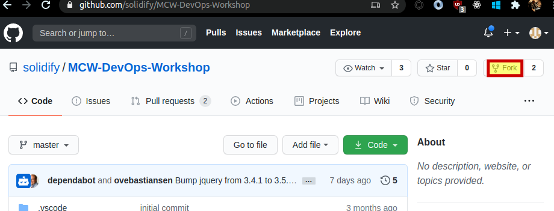

4. Choose your account as the target for the fork:
Note that you can only fork a repository once into your account.


5. Forking best practices.
It's common to leave the main/master branch as a true copy of the forked repo. And use another branch for your local changes. 

6. Clone, commit, and Push to your fork

Clone the repository on your local machine `git clone https://github.com/solidify/MCW-DevOps-Workshop.git` (optionally choose the ssh link)

Create a file called `README.md`

Add it to the repo: `git add README.md`

Commit it `git commit -m "Added Readme.md"` 

Then push it `git push`


## Exercise 2: Create Dockerfile

Duration: 10 Minutes

In this excersice we implement a container definition. We do this with a 'Dockerfile' and by defining all our steps inside it.

Containers have multiple purposes, among them are concistency, simplicity, and portability. Docker containers are the most videly spread container technology today. It is what we use here.

Containers are a way to make sure that your build and runtime is the same wherever you run it - Portability. 

To simplify the matter containers describe a set of steps that define the build and runtime environment - Simplicity. 

When your container is defined, you know it will run with the same result wherever you run it - Concistency.

### Task 1: Create a Dockerfile

1. Create a file called Dockerfile 

Right click in your editor -> choose 'New File'. 
Or write `touch Dockerfile` in a terminal.

2. Multistage docker file

We will be using the concept of multistage docker files in this demo, so first we set our base image to the aspnet 5.0 runtime, and then create a new layer that points to the .NET 5.0 SDK image.
```
FROM mcr.microsoft.com/dotnet/aspnet:5.0 AS base
WORKDIR /app
ENV ASPNETCORE_URLS http://+:5000
EXPOSE 5000

FROM mcr.microsoft.com/dotnet/sdk:5.0 AS build
```

3. Add source code and build the app

Load the container with source code and build the code.

First include the code by adding these lines in your Dockerfile: 
```
WORKDIR /src
COPY ["src/TailspinToysWeb/TailspinToysWeb.csproj", "src/TailspinToysWeb/"]
```

Then we will build the code in the container by adding:  
```
RUN dotnet restore "src/TailspinToysWeb/TailspinToysWeb.csproj"
COPY . .
WORKDIR "/src/src/TailspinToysWeb"
RUN dotnet build "TailspinToysWeb.csproj" -c Release -o /app/build

# publish the app
FROM build AS publish
RUN dotnet publish "TailspinToysWeb.csproj" -c Release -o /app/publish
```

We use dotnet publish to package the source-code in a proper way. 

4. Running the app in the container

Now the container has the code and all dependencies it needs.

We have to tell it to run our application, and make sure we use the run-time base image:
```
FROM base AS final
COPY --from=publish /app/publish .
ENTRYPOINT ["dotnet", "TailspinToysWeb.dll"]
```

5. See if it works?

We have to have a Workflow to test the container i Github Actions. Commit and push your new dockerfile to your Github repo. Then continue to Excercise 3 below.

If you have docker installed on your local machine you can now build and run the container. While running the container you can visit localhost:5000 to see that the app is running.
```
docker build -t tailspintoysweb:dev .
docker run -d -p 5000:5000 tailspintoysweb:dev
```

6. The final result of the Dockerfile

```
#See https://aka.ms/containerfastmode to understand how Visual Studio uses this Dockerfile to build your images for faster debugging.

FROM mcr.microsoft.com/dotnet/aspnet:5.0 AS base
WORKDIR /app
ENV ASPNETCORE_URLS http://+:5000
EXPOSE 5000

FROM mcr.microsoft.com/dotnet/sdk:5.0 AS build
WORKDIR /src
COPY ["src/TailspinToysWeb/TailspinToysWeb.csproj", "src/TailspinToysWeb/"]
RUN dotnet restore "src/TailspinToysWeb/TailspinToysWeb.csproj"
COPY . .
WORKDIR "/src/src/TailspinToysWeb"
RUN dotnet build "TailspinToysWeb.csproj" -c Release -o /app/build

FROM build AS publish
RUN dotnet publish "TailspinToysWeb.csproj" -c Release -o /app/publish

FROM base AS final
WORKDIR /app
COPY --from=publish /app/publish .
ENTRYPOINT ["dotnet", "TailspinToysWeb.dll"]
```


## Exercise 3: Setup up shared infrastructure and secrets we will use

Duration 20 min. 

We will need the Azure Container registry later, so we use it as an example to get some secret to store. When building code it's important to control access to your systems. When adding usernames and passwords we need to secure these.

In GitHub we do this by adding Secrets to our repository, there is also an option to store this on the organization level and give access to the secret inside the different repos

It's important to note that in a production setting we would create separate secrets for each environment and lock down secrets editing. And even better use an azure vault to store our secrets.

### Task 1: Create container registry

1. Goto add container registry
Go to the azure portal: `portal.azure.com`. On your subscription navigate to 'container registry'. And create a new one. 

  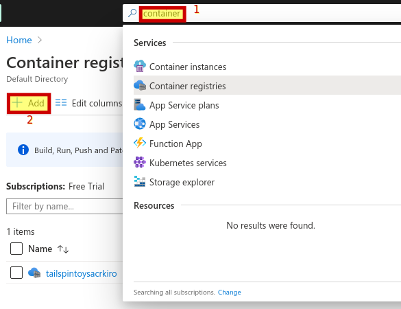 

Click the '+ Add' button to create a new registry.

2. Create container registry

Select your workshop resource group and set the name of the registry. Take note of the name as you will need this later.

  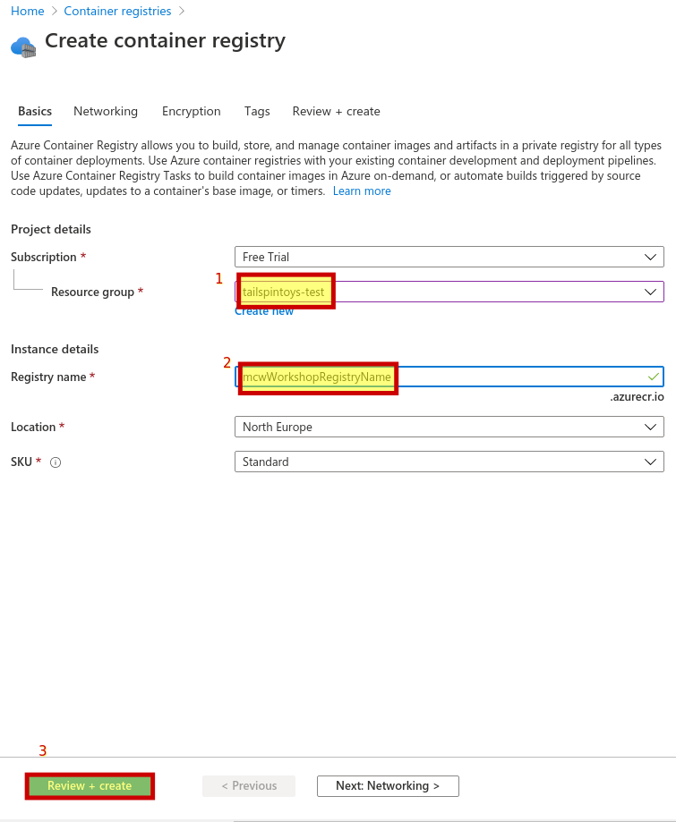 

3. Enable admin access

When the ACR is created we need to enable 'Access Keys' to be able to use registry in our workshop.

Go to 'Access Keys' and click 'Enable' under admin user. Then we can use one of the passwords in our secret variables, also remember what the username is, we will also have to add that to the workflow variables

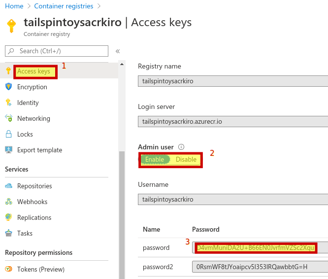

4. Create secret in GitHub

After enabling admin user, go to settings under your fork to create a secret
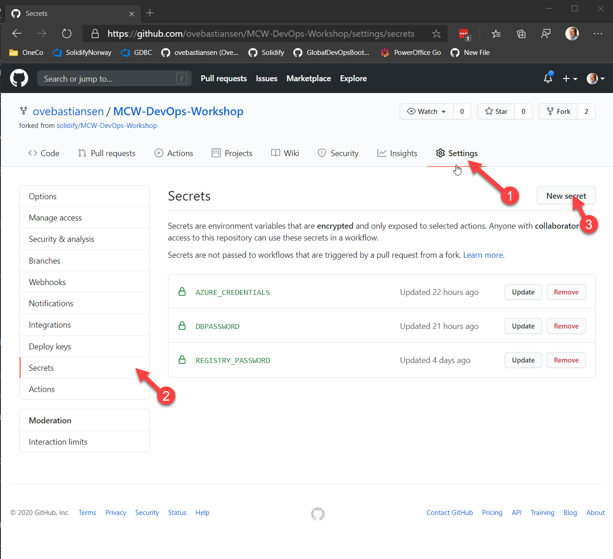
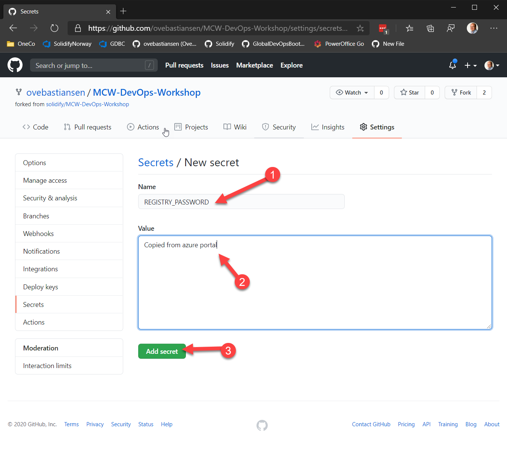

### Task 2: Create a service account to be able to log on azure cli in our pipeline

We will need a service principal to use when running the deployment scripts in GitHub Actions. By running this command you will get a json output which you can add as secrets inside of settings. Follow the same procedure as previous step to create a AZURE_CREDENTIALS for the json that is output'et.
  ```yml
   az login
   #verify that the selected azure subscription is correct
   az ad sp create-for-rbac --name "mcwworkshop" --role contributor --sdk-auth
  ```                   
  

### Task 3: Add a DBPASSWORD secret

1. Add a new secret called DBPASSWORD that contains a relativ hard password for the database. One uppercase letter, and one specialchar and minimum 8 chars. We will use this when running an ARM template to provision all resources needed for this website.

## Exercise 4: Create GitHub Action workflow

Duration: 15 Minutes

Implementing CI and CD pipelines helps to ensure consistent and quality code that's readily available to users. GitHub Action workflows is a quick, easy, and safe way to automate building your projects and making them available to users.

In this exercise, you will create a build definition in GitHub Actions, that will automatically build the web application with every commit of source code. This will lay the groundwork for us to then create a release pipeline for publishing the code to our Azure environments.
  
### Task 1: Create a workflow

Workflows are made of one or more jobs describing a CI/CD process. Jobs are the major divisions in a workflow: "build this app", "run these tests", and "deploy to pre-production" are good examples of jobs.

Workflows consist of one or more jobs, which are units of work assignable to a particular machine. GitHub Actions can contain multiple workflows that trigger on different rules. That means that you can logically split workflows depending on what you want to do.

Jobs consist of a linear series of steps. Steps can be built-in actions, scripts, third-party actions or references actions in the same repo.

This hierarchy is reflected in the structure of a YAML file. The workflows needs to follow different sets of rules. First of it needs to be in a folder named .github/workflows and have a file ending on either .yml or .yaml, and it needs to be syntactic correct

1. In your fork project, select the **Actions** menu option from the banner navigation inside your repo. Select the **New workflow** button to create a new workflow.

    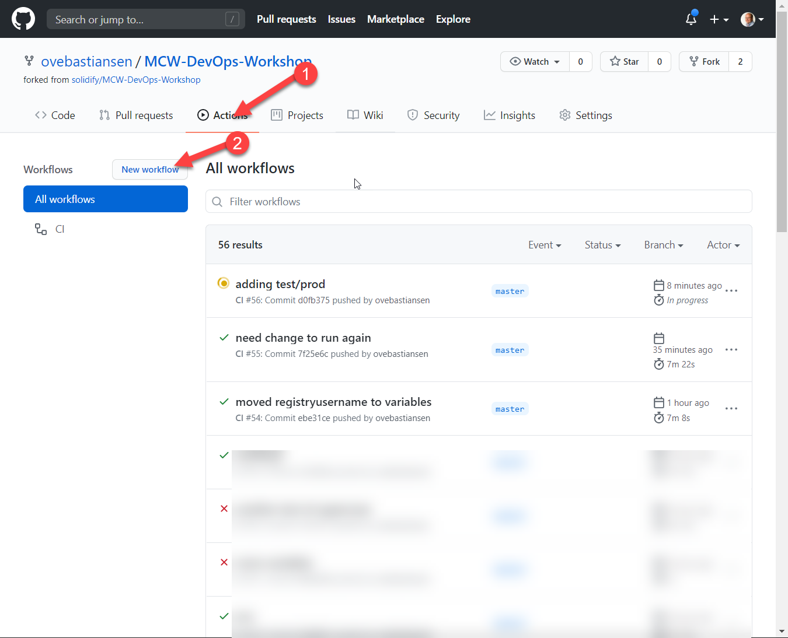

2. Then, you'll need to select the type of workflow to configure. Since this repository contains a mix of technologies and we want to use Docker Build, select **set up this workflow yourself** from the wizard that comes up.

    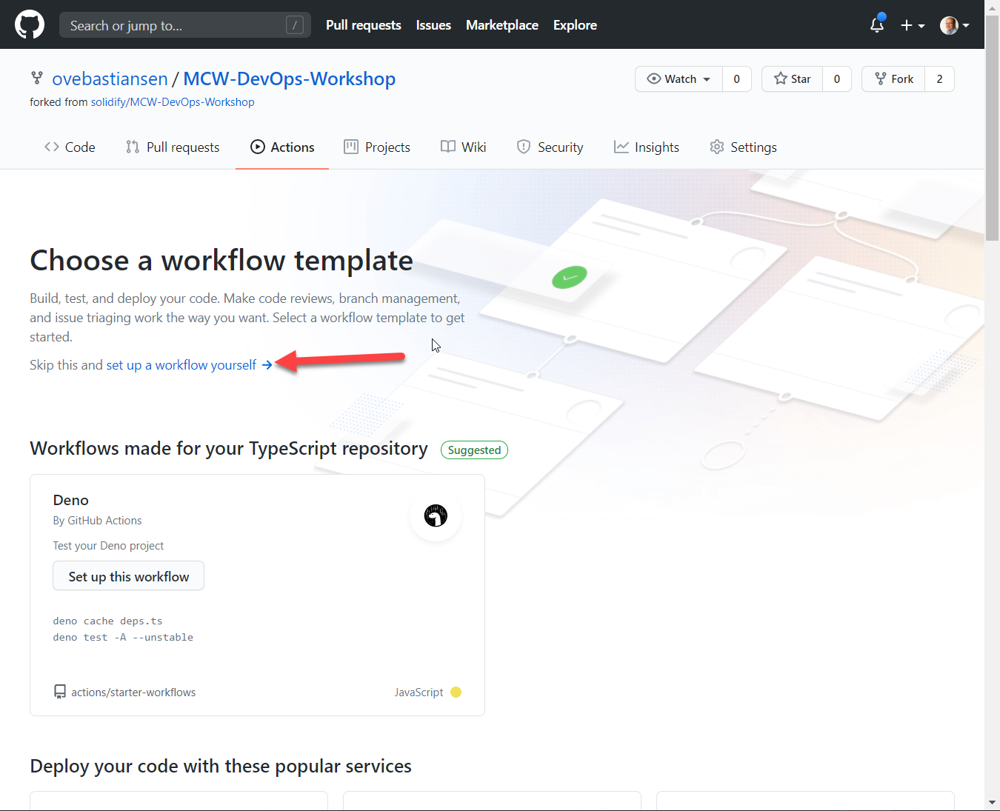

3. As a final step in the creation of a workflow, you are presented with a configured workflow in the form of an .github/workflow/main.yml file. 
   This starter YAML file contains a few lines of instructions (shown below) for the pipeline. Let's begin by updating the YAML with more specific instructions to build our application. 

    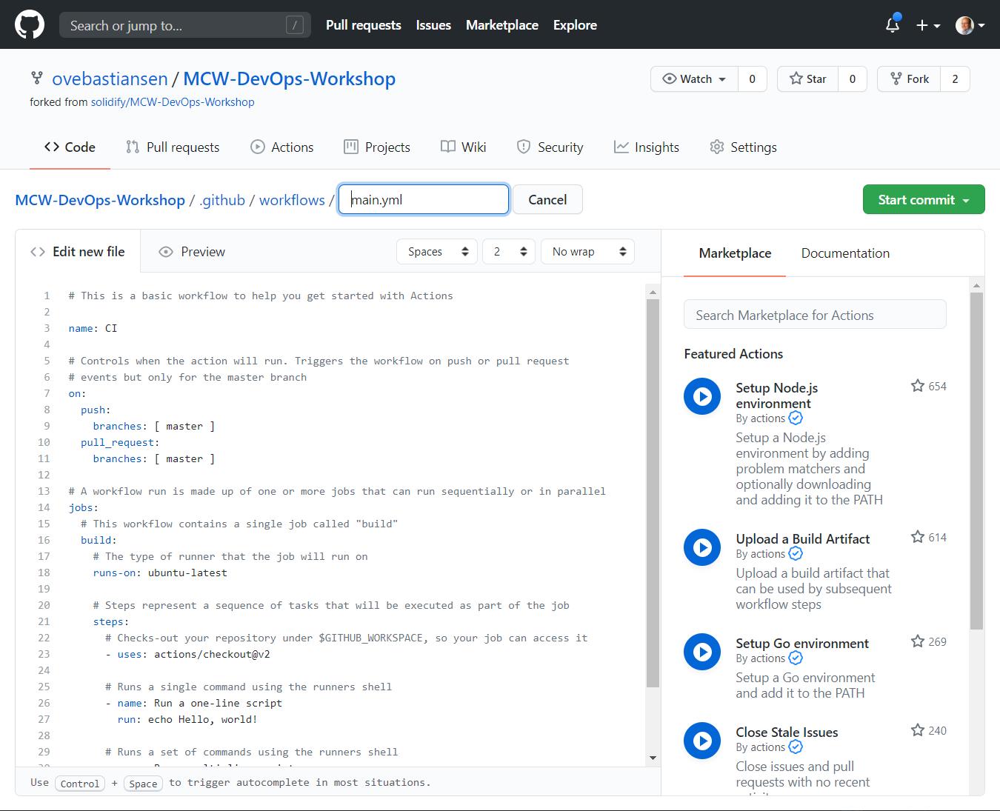


4. There is a notion of variables you can reuse in different places in the workflow. They are added as environment variables. So add a section that contains these variables

    ```yml
    env:
      resourcegroup: <name of the resourcegroup you want to create in this workshop>
      containerregistry: <the name of a Azure Container Registry *.azurecr.io>
      registryusername: <the admin username for Azure Container Registry>
      imagename: <the name of a Azure Container Registry *.azurecr.io>/tailspintoys/web
    ```

10. Steps are a linear sequence of operations that make up a job. Each step runs in its own process on an agent and has access to the workflow workspace on disk. Select and replace the *steps* section with the following code:
    
    ```yml
    steps:
      # Checks-out your repository under $GITHUB_WORKSPACE, so your job can access it
      - uses: actions/checkout@v2

      - name: Set up Docker Buildx
        uses: docker/setup-buildx-action@v1
      
      - name: Login to ACR
        uses: docker/login-action@v1
        with:
          registry: ${{ env.containerregistry }}
          username: ${{ env.registryusername }}
          password: ${{ secrets.REGISTRY_PASSWORD }}

      - name: Build and push
        id: docker_build
        uses: docker/build-push-action@v2
        with:
          push: true
          tags: ${{ env.imagename }}:${{ github.sha }}

      - name: Upload arm templates to workflow
        uses: actions/upload-artifact@v2
        with:
          name: armtemplate
          path: ${{ github.workspace }}/armtemplate/
    ```

    Steps are the building blocks of a workflow. They describe the actions that are performed in sequence during an execution of the job. The steps here are first checking out the code, then logging into the container registry and then builds and pushes that image to the registry. The final publish is to make the arm template available for the next job we are going to create for deploying the full solution.

11. The final result will look like the following:

    ```yml
    name: CI/CD of containers with GitHub Actions

    # Controls when the action will run. Triggers the workflow on push or pull request
    # events but only for the master branch
    on:
      push:
        branches: [master]
      pull_request:
        branches: [master]

    env:
      resourcegroup: mcwworkshoprg
      containerregistry: mcwworkshop.azurecr.io
      registryusername: mcwworkshop
      imagename: mcwworkshop.azurecr.io/tailspintoys/web
      
    # A workflow run is made up of one or more jobs that can run sequentially or in parallel
    jobs:
      build:
        # The type of runner that the job will run on
        runs-on: ubuntu-latest

        # Steps represent a sequence of tasks that will be executed as part of the job
        steps:
          # Checks-out your repository under $GITHUB_WORKSPACE, so your job can access it
          - uses: actions/checkout@v2

          - name: Set up Docker Buildx
            uses: docker/setup-buildx-action@v1
          
          - name: Login to ACR
            uses: docker/login-action@v1
            with:
              registry: ${{ env.containerregistry }}
              username: ${{ env.registryusername }}
              password: ${{ secrets.REGISTRY_PASSWORD }}

          - name: Build and push
            id: docker_build
            uses: docker/build-push-action@v2
            with:
              push: true
              tags: ${{ env.imagename }}:${{ github.sha }}

          - name: Upload arm templates to workflow
            uses: actions/upload-artifact@v2
            with:
              name: armtemplate
              path: ${{ github.workspace }}/armtemplate/
    ```

12. Choose the **Start commit** button to save our new workflow on the master branch, this will also kick off the first build. The new *main.yml* file will automatically be added to the .github/workflows/ folder of your TailspinToys repository. This is done through a git commit that GitHub facilitates. You are then asked to enter a commit description. By default, it will be populated for you. Once again, select the **Commit new file** button at the bottom of the screen.

    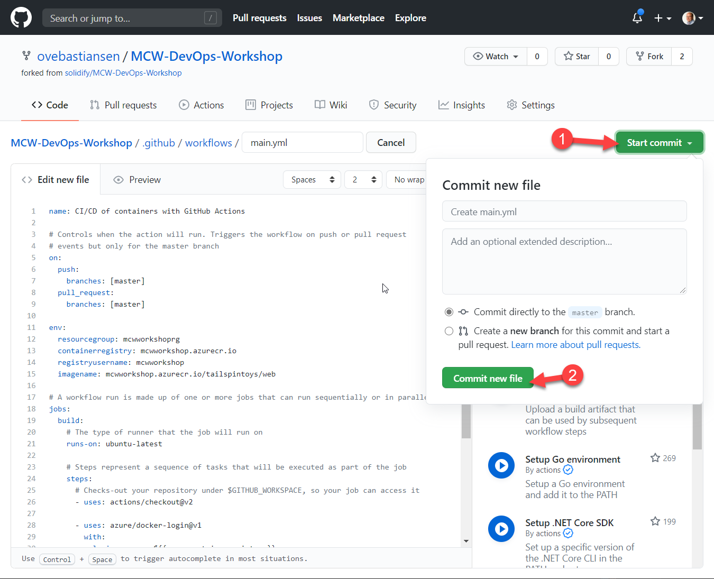    

14. The build process will immediately begin and run through the steps defined in the main.yml file. You have to go back to the **Actions** tab to follow the build.

    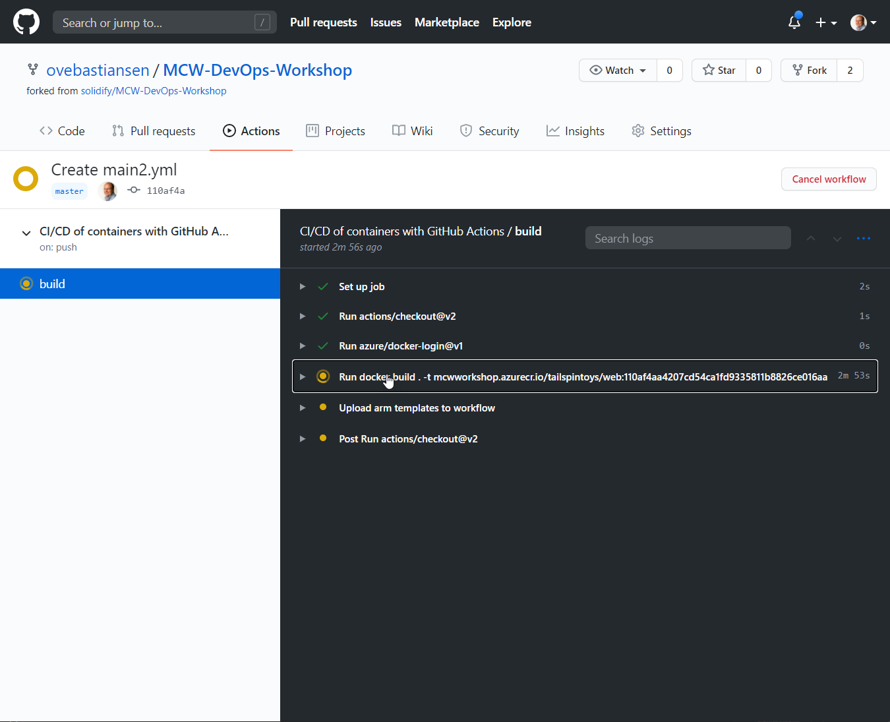   

15. After the build process completes, you should see a green check mark next to each of the build pipeline steps.
  
    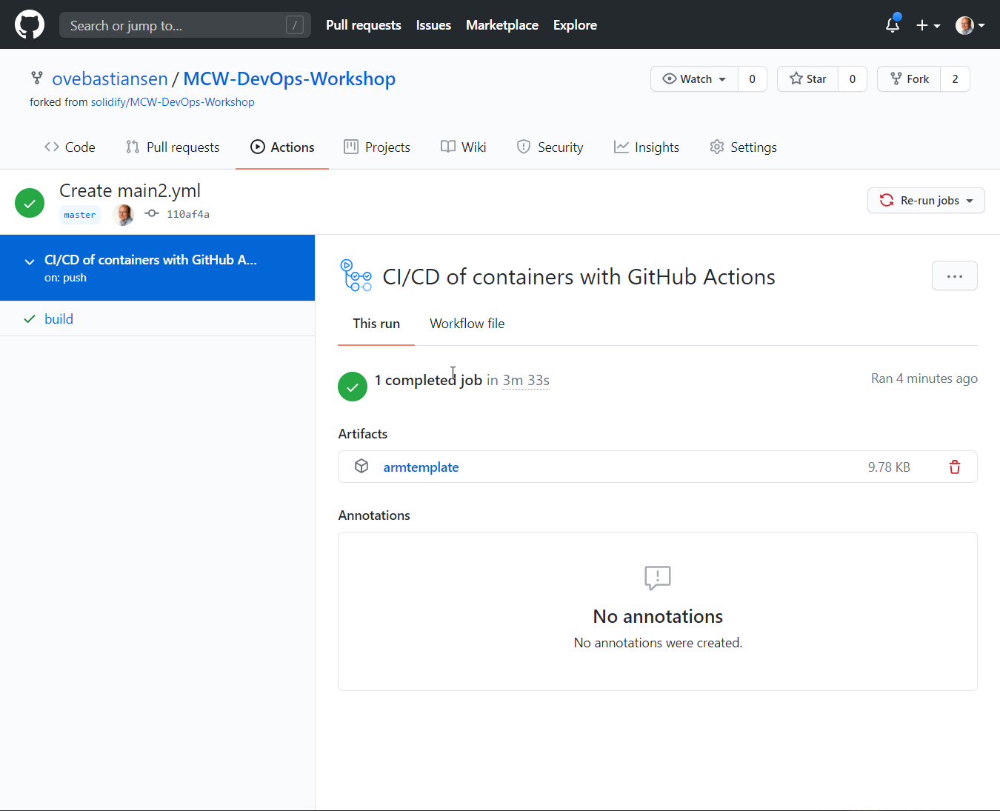 
    
    Congratulations! You have just created your first workflow. In the next exercise, we will create a release pipeline that deploys your successful builds.


## Exercise 5: Add release steps to the workflow

Duration: 20 Minutes

In this exercise, you will make changes to the workflow, so that we run a deployment to multiple environments. This means that the workflow containes jobs for performing automated deployments of build artifacts to Microsoft Azure. The workflow will have 4 different jobs that first builds the artifacts and then deploys to three stages: dev, test, and production.

### Task 1: Add deployment to dev in the workflow

1. First we are going to add a new job for deployment to dev. The **needs** setting indicates that this job has to run after the build stage is completed
    ```yml
    deploy-dev:
        runs-on: ubuntu-latest
        needs: build
    ```
2. The setup looks the same structure, and we can download all the code if we want, but there is a action for downloading the artifact that we published in the build job. In a normal workflow, this is the preferred way of structuring the deployment. If the git repository is quite big, checking out the code might be a slow process. This workflow does not have that much artifact since we are publishing the image in the build job, but there are ways to structure this that the build job runs for all branches, but we only run a publish job if we are on master branch.  

    ```yml
    steps:
      - name: Download armtemplate
        uses: actions/download-artifact@v2
        with:
          name: armtemplate
    ```

3. The next part is login into Azure using the secret we created in Exercise 3.
    ```yml
    - name: Login to Azure
      uses: azure/login@v1
      with:
        creds: ${{ secrets.AZURE_CREDENTIALS }}
    ```

4. Then we need to create the Azure Resource Group so that the application arm template has somewhere to be deployed to
    ```yml
    - name: Deploy resource group 
      uses: azure/CLI@v1
      with:
        inlineScript: |
          az group create -l westeurope -n ${{ env.resourcegroup }}
    ```
4. After that we can run az commands in our workflow. We will now add a **run:** action that contains inline scripts. We are targeting powershell core with the setting **shell: pwsh**. We are using the arm template we pushed as artifacts in the build job to provision our dev website and the dev database. We are using powershell for getting the output variable, since our ARM template contains an output variable of new website name and we now need to parse that output of the webappname so we can use that to target our deployment in Azure
    ```yml
    - name: Deploy ARM template
      run: |
        $output = az deployment group create --resource-group ${{ env.resourcegroup }} --template-file azuredeploy.json --parameters environment=dev --parameters administratorLogin=JallaJalla --parameters administratorLoginPassword=${{ secrets.DBPASSWORD }}
        $armOutputObj = $output | ConvertFrom-Json
        $webAppName = $armOutputObj.properties.outputs.webappname.value
        echo "webAppName=$webAppName" | Out-File -FilePath $env:GITHUB_ENV -Encoding utf8 -Append
      shell: pwsh
    ```

5. Now we are using Azure CLI to actually deploy our containerimage into our Azure App Service. We are using Azure CLI to deploy our container into Azure AppService for Containers. We also deploy to a staging slot and then swap to production slot after the deployment is done and the website is ready to take traffic.
    ```yml
    - name: Deploy webapp to staging slot
      uses: azure/CLI@v1
      with:
        inlineScript: |
          az webapp config container set \
                      --resource-group ${{ env.resourcegroup }} \
                      --name ${{ env.webAppName }} \
                      --docker-custom-image-name ${{ env.imagename }}:${{ github.sha }} \
                      --docker-registry-server-password ${{ secrets.REGISTRY_PASSWORD }} \
                      --docker-registry-server-url https://${{ env.containerregistry }} \
                      --docker-registry-server-user ${{ env.registryusername }} \
                      --slot staging

    - name: Swap slots for webapp
      uses: azure/CLI@v1
      with:
        inlineScript: |
          az webapp deployment slot swap -g ${{ env.resourcegroup }} -n ${{ env.webAppName }} --slot staging --target-slot production
    ```

6. The final result will look like the following:

    ```yml
    deploy-dev:
      runs-on: ubuntu-latest
      needs: build
      steps:
        - name: Download armtemplate
          uses: actions/download-artifact@v2
          with:
            name: armtemplate

        - name: Login to Azure
          uses: azure/login@v1
          with:
            creds: ${{ secrets.AZURE_CREDENTIALS }}

        - name: Deploy resource group
          uses: azure/CLI@v1
          with:
            inlineScript: |
              az group create -l westeurope -n ${{ env.resourcegroup }}

        - name: Deploy ARM template
          run: |
            $output = az deployment group create --resource-group ${{ env.resourcegroup }} --template-file azuredeploy.json --parameters environment=dev --parameters administratorLogin=JallaJalla --parameters administratorLoginPassword=${{ secrets.DBPASSWORD }}
            $armOutputObj = $output | ConvertFrom-Json
            $webAppName = $armOutputObj.properties.outputs.webappname.value
            echo "webAppName=$webAppName" | Out-File -FilePath $env:GITHUB_ENV -Encoding utf8 -Append
          shell: pwsh

        - name: Deploy webapp to staging slot
          uses: azure/CLI@v1
          with:
            inlineScript: |
              az webapp config container set \
                          --resource-group ${{ env.resourcegroup }} \
                          --name ${{ env.webAppName }} \
                          --docker-custom-image-name ${{ env.imagename }}:${{ github.sha }} \
                          --docker-registry-server-password ${{ secrets.REGISTRY_PASSWORD }} \
                          --docker-registry-server-url https://${{ env.containerregistry }} \
                          --docker-registry-server-user ${{ env.registryusername }} \
                          --slot staging

        - name: Swap slots for webapp
          uses: azure/CLI@v1
          with:
            inlineScript: |
              az webapp deployment slot swap -g ${{ env.resourcegroup }} -n ${{ env.webAppName }} --slot staging --target-slot production
    ```

7. Congratulations! You can now save the file, and push it to the master branch and wait for the trigger to kick in to deploy it to your dev web site

### Task 2: Add test and production environments to the workflow

1. Now open the main.yml file once more and copy/paste the deploy-dev job twice, one for test and one for production. You need to update the **needs** tag to match the correct previous job and the name of the environment to the current target. Also the name of the webapp will now contain test and production instead of dev.

2. The new release jobs in the workflow will now look like this
    
    ```yml
    deploy-test:
      runs-on: ubuntu-latest
      needs: deploy-dev
      steps:
        - name: Download armtemplate
          uses: actions/download-artifact@v2
          with:
            name: armtemplate

        - name: Login to Azure
          uses: azure/login@v1
          with:
            creds: ${{ secrets.AZURE_CREDENTIALS }}
        
        - name: Deploy resource group
          uses: azure/CLI@v1
          with:
            inlineScript: |
              az group create -l westeurope -n ${{ env.resourcegroup }}

        - run: |
            $output = az deployment group create --resource-group ${{ env.resourcegroup }} --template-file azuredeploy.json --parameters environment=test --parameters administratorLogin=JallaJalla --parameters administratorLoginPassword=${{ secrets.DBPASSWORD }}
            $armOutputObj = $output | ConvertFrom-Json
            $webAppName = $armOutputObj.properties.outputs.webappname.value
            az webapp config container set `
                          --resource-group ${{ env.resourcegroup }} `
                          --name $webappname `
                          --docker-custom-image-name ${{ env.imagename }}:${{ github.sha }} `
                          --docker-registry-server-password ${{ secrets.REGISTRY_PASSWORD }} `
                          --docker-registry-server-url https://${{ env.containerregistry }} `
                          --docker-registry-server-user ${{ env.registryusername }} `
                          --slot staging
            echo "webAppName=$webAppName" | Out-File -FilePath $env:GITHUB_ENV -Encoding utf8 -Append
          shell: pwsh

        - name: Swap slots for webapp
          uses: azure/CLI@v1
          with:
            inlineScript: |
              az webapp deployment slot swap -g ${{ env.resourcegroup }} -n ${{ env.webAppName }} --slot staging --target-slot production
    
    deploy-prod:
      runs-on: ubuntu-latest
      needs: deploy-test
      steps:
        - name: Download armtemplate
          uses: actions/download-artifact@v2
          with:
            name: armtemplate

        - name: Login to Azure
          uses: azure/login@v1
          with:
            creds: ${{ secrets.AZURE_CREDENTIALS }}

        - name: Deploy resource group
          uses: azure/CLI@v1
          with:
            inlineScript: |
              az group create -l westeurope -n ${{ env.resourcegroup }}

        - run: |
            $output = az deployment group create --resource-group ${{ env.resourcegroup }} --template-file azuredeploy.json --parameters environment=production --parameters administratorLogin=JallaJalla --parameters administratorLoginPassword=${{ secrets.DBPASSWORD }}
            $armOutputObj = $output | ConvertFrom-Json
            $webAppName = $armOutputObj.properties.outputs.webappname.value
            az webapp config container set `
                          --resource-group ${{ env.resourcegroup }} `
                          --name $webappname `
                          --docker-custom-image-name ${{ env.imagename }}:${{ github.sha }} `
                          --docker-registry-server-password ${{ secrets.REGISTRY_PASSWORD }} `
                          --docker-registry-server-url https://${{ env.containerregistry }} `
                          --docker-registry-server-user ${{ env.registryusername }} `
                          --slot staging
            echo "webAppName=$webAppName" | Out-File -FilePath $env:GITHUB_ENV -Encoding utf8 -Append
          shell: pwsh

        - name: Swap slots for webapp
          uses: azure/CLI@v1
          with:
            inlineScript: |
              az webapp deployment slot swap -g ${{ env.resourcegroup }} -n ${{ env.webAppName }} --slot staging --target-slot production      
    ```
3. You can now save the file, and push it to the master branch and wait for the trigger to kick in to deploy it to your dev/test/production web sites

Congratulations! You have completed the creation of a workflow that builds and pushes the website to three different environments.
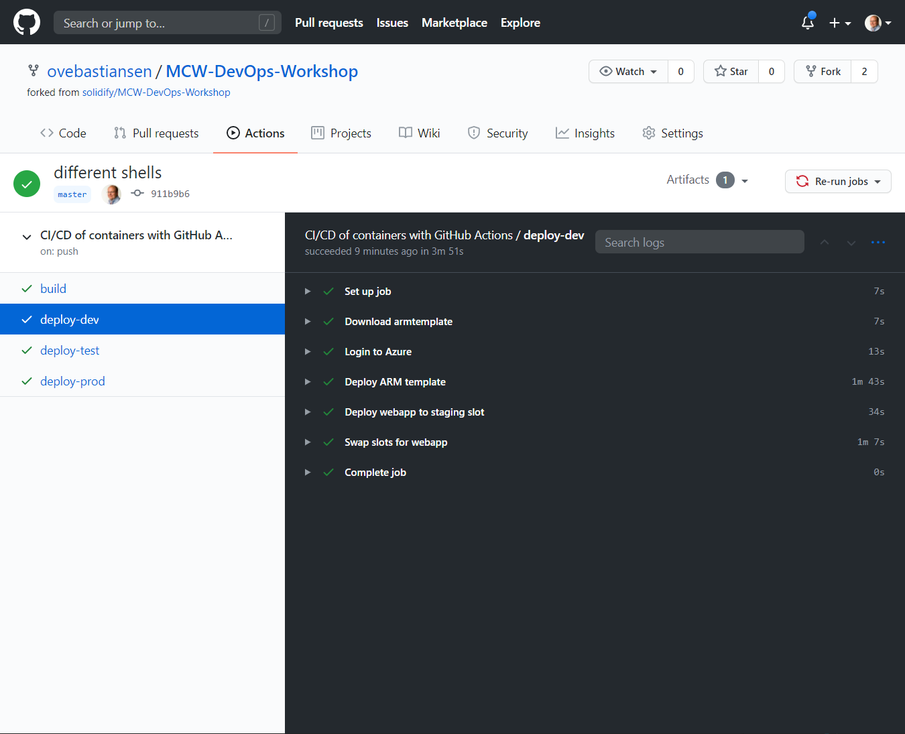 

## Exercise 6: Set up a Pull Request policy, create a task branch and submit a pull request

Duration: 30 Minutes

In this exercise, you will first set up a Pull request policy for your master branch, then you will create a short-lived task branch, make a small code change, commit and push the code, and submit a pull request. 
You'll then merge the pull request into the master branch which triggers an automated build and release of the application.

In the tasks below, you will make changes directly through the Azure DevOps web interface. These steps could also be performed locally through an IDE of your choosing or using the command line.

### Task 1: Commit new file with a Pull request

1. Select the branch you want to change or add content to.

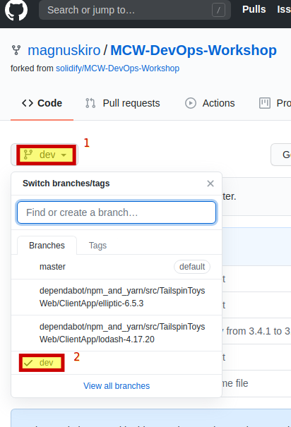


2. Choose 'add file' to add a file to the repo.


3. Edit the file and choose new branch

Choose name and content for the file.

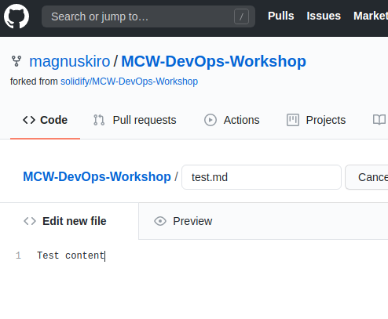

Then create a commit heading, and describe the change in the commit.
Make sure to select "new branch" when you create files in a repo with multiple contributors.

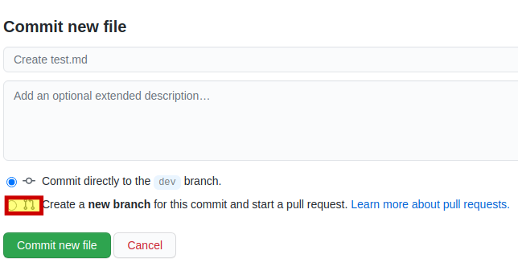

Now the file should be added to a new branch. 


4. Create a pull request

Navigate to 'Pull requests'.
The click "compare & pull request"
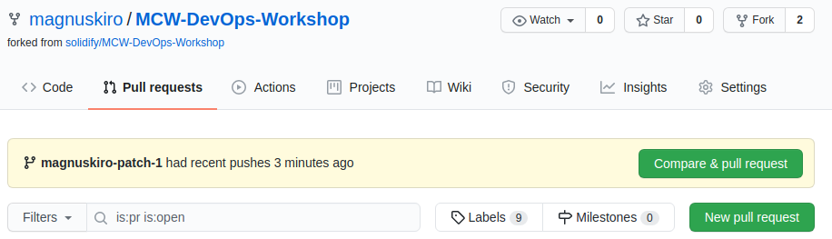


Then choose the correct repositofy and branch you want to push to.

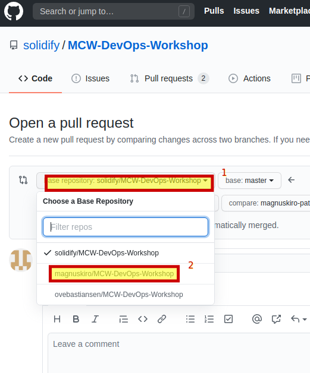

Add apropriate description, reviewers, and labels to the pull request.

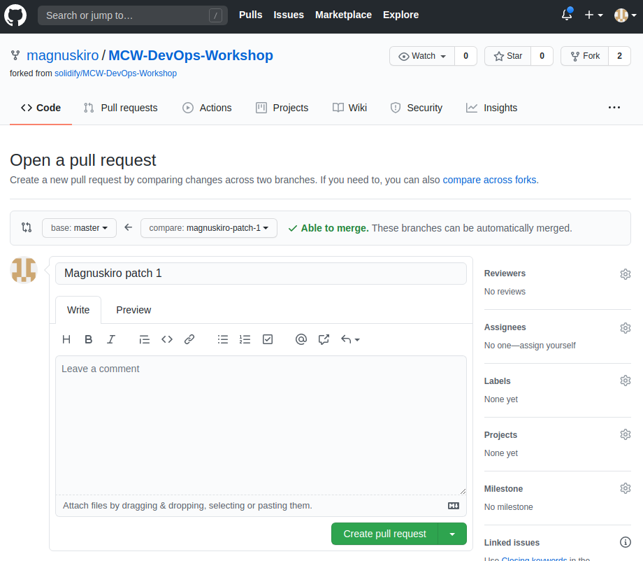

Then click create.

5. Merge the pull request
Now you can see the created pull request. 
If everything is good, then you can merge it.
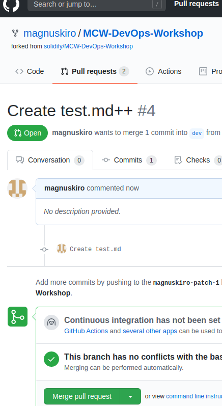


### Task 2: Configure branch protection rules

Here you can add rules to your branches to better control the quality of the code that is merged to your branches.
The typical rules you add are to enforce reviewers on pull requests, and passed status checks so that automated testing and integrations are OK.

1. Navigate to settings
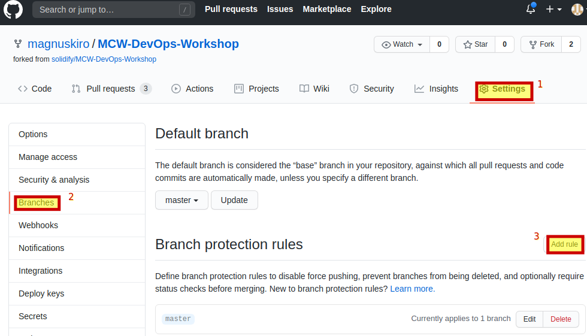


2. Add new rules

Set the text pattern that matches the branches you want rules for. 

Then enable the rules you want. Typically `Require pull request reviews before merging` and `Require status checks to pass before merging`

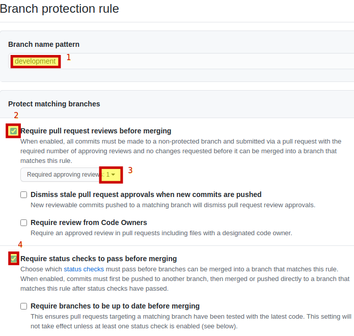

3. Status checks 
It's common to use the status check rules. These are sanity checks such as checking if you have a license file, or if you don't have any work in progress items left when you want to merge. Pull request reviewers is also a common rule. In general you want someone to approve your code before you merge it.

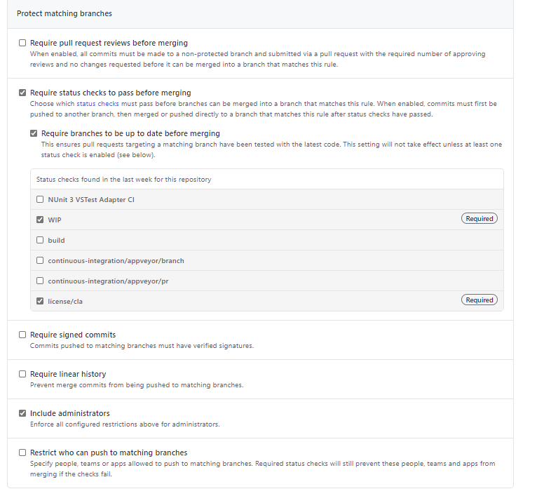

4. Results of the rules
When the sules are evaluated in a pull request it looks something like the following

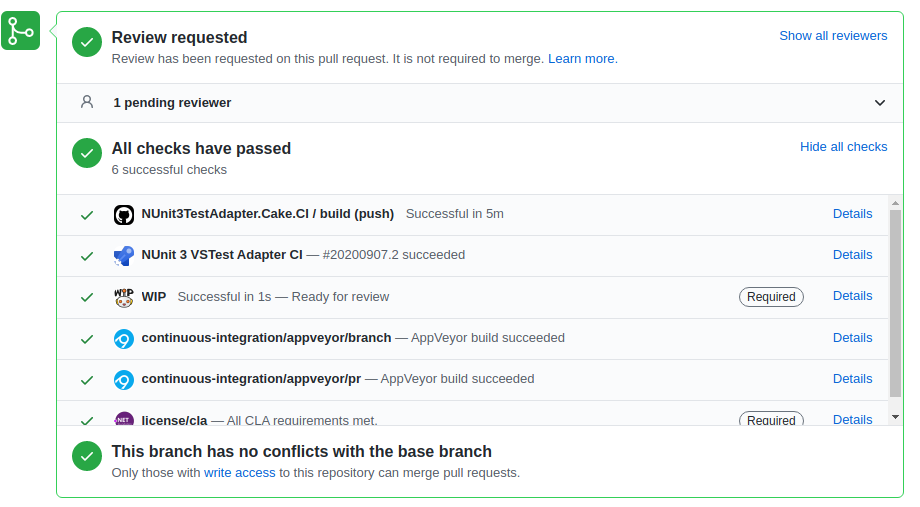


## After the hands-on lab

Duration: 10 Minutes

### Task 1: Delete resources

1.  Now since the hands-on lab is complete, go ahead and delete the resource group you created for the Tailspin Toys deployments. You will no longer need those resources and it will be beneficial to clean up your Azure Subscription.

These steps should be followed only *after* completing the hands-on lab.
